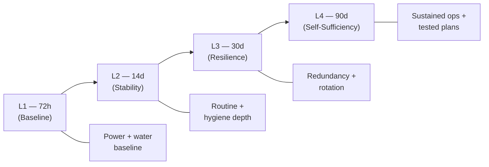
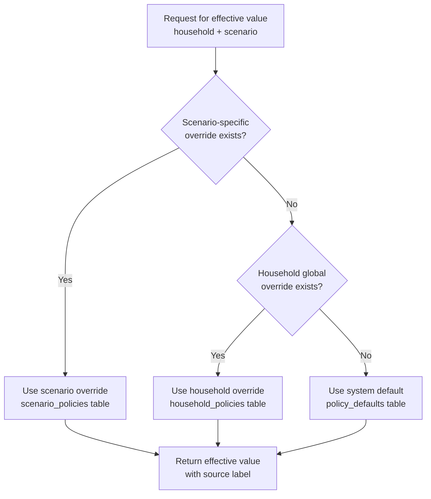
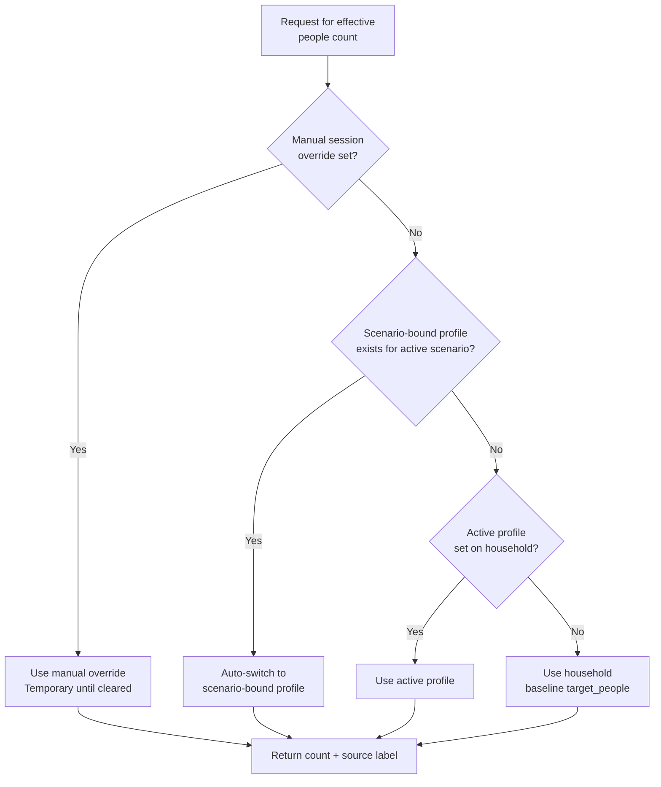

# 01 — Theory and Figures


This document explains the planning assumptions, default values, and the reasoning behind every configurable figure in bePrepared. Understanding the "why" behind each number helps you make informed overrides for your household.

---

## Table of Contents

1. [Water Planning — Default 4.0 L/person/day](#1-water-planning--default-40-lpersonday)
2. [Calorie Planning — Default 2200 kcal/person/day](#2-calorie-planning--default-2200-kcalpersonday)
3. [Readiness Level Duration Targets](#3-readiness-level-duration-targets)
4. [Policy Precedence Model](#4-policy-precedence-model)
5. [People Count Resolution Model](#5-people-count-resolution-model)
6. [Household Totals Calculation](#6-household-totals-calculation)
7. [Scenario Differences: Shelter vs Evacuation](#7-scenario-differences-shelter-vs-evacuation)
8. [Alert Window Defaults](#8-alert-window-defaults)
9. [Maintenance Interval Rationale](#9-maintenance-interval-rationale)

---

## 1. Water Planning — Default 4.0 L/person/day

### Source Basis

The system default of **4.0 litres per person per day** is derived from:

| Source                                | Minimum               | Planning                 |
| ------------------------------------- | --------------------- | ------------------------ |
| WHO Emergency Minimum (drinking only) | 2.0 L/day             | —                        |
| FEMA 72-hour guideline                | 1 gallon (3.78 L)/day | Drinking + sanitation    |
| Red Cross shelter standard            | 3.5–5.0 L/day         | Drinking + basic hygiene |
| **bePrepared default**                | —                     | **4.0 L/day**            |

### What 4.0 L Covers

- **~2.0 L** drinking
- **~0.5 L** food preparation (rehydrating, cooking)
- **~1.5 L** basic personal hygiene (face, hands)
- Does **not** include: laundry, toilet flushing, bathing

### When to Override

| Scenario                               | Suggested Override | Reason                          |
| -------------------------------------- | ------------------ | ------------------------------- |
| Evacuation (carry constraint)          | 3.0–3.5 L          | Weight limitations on carry     |
| Shelter-in-place with sanitation needs | 5.0–8.0 L          | Toilet flushing / bucket flush  |
| Hot climate / high exertion            | 5.0–6.0 L          | Increased sweat/hydration need  |
| Infants / elderly                      | 5.0+ L             | Additional hygiene requirements |

[↑ Go to TOC](#table-of-contents)

---

## 2. Calorie Planning — Default 2200 kcal/person/day

### Source Basis

| Source                                  | Value          | Context                           |
| --------------------------------------- | -------------- | --------------------------------- |
| US Dietary Guidelines (sedentary adult) | 1800–2000 kcal | Normal daily living               |
| FEMA/USDA emergency food planning       | 2000 kcal      | Baseline emergency                |
| Military field rations (MRE)            | 1200–3800 kcal | Activity-dependent                |
| **bePrepared default**                  | **2200 kcal**  | Mixed-activity shelter operations |

### Why 2200 kcal

A 2200 kcal target:

- Covers a mixed adult household across sedentary and light-active profiles
- Provides a buffer above bare survival (~1200 kcal) for cognitive function, immune support, and morale
- Works as a practical planning number without over-inflating stock requirements
- Does **not** account for high exertion (manual labour, long hikes) — override if needed

### Nutritional Composition Target

When stocking food, aim for:

- **50–60%** carbohydrates (grains, rice, pasta, oats)
- **15–20%** protein (canned meat, legumes, nuts)
- **25–30%** fats (oils, nut butters, canned fish)

[↑ Go to TOC](#table-of-contents)

---

## 3. Readiness Level Duration Targets

The four readiness levels correspond to recognisable disaster timelines:

| Level         | Duration | Scenario Basis                                                      |
| ------------- | -------- | ------------------------------------------------------------------- |
| L1 — 72 hours | 3 days   | Power outage, severe weather, immediate disruption                  |
| L2 — 14 days  | 2 weeks  | Extended outage, regional infrastructure failure, supply disruption |
| L3 — 30 days  | 1 month  | Prolonged regional emergency, extended supply chain disruption      |
| L4 — 90 days  | 3 months | Major societal disruption, long-term self-sufficiency               |



Each level **unlocks** the next. You cannot achieve L2 without completing all L1 tasks.

[↑ Go to TOC](#table-of-contents)

---

## 4. Policy Precedence Model

Every configurable value (water, calories, alert windows) resolves through a three-tier system:



**Tier 1 — Scenario override** (highest priority)
: Set in `Settings → Planning Targets → Scenario tab`
: Applies only when the matching scenario is active

**Tier 2 — Household global override**
: Set in `Settings → Planning Targets → Global`
: Applies to all scenarios unless a scenario-specific value exists

**Tier 3 — System default** (lowest priority)
: Seed values in `policy_defaults` table
: Cannot be changed without DB access; reset-to-default deletes the override

[↑ Go to TOC](#table-of-contents)

---

## 5. People Count Resolution Model

The effective people count for all calculations resolves through four levels:



**Scenario auto-switch**: When a profile is bound to a scenario (e.g. `evacuation`), switching to that scenario automatically selects that profile's people count. Manual override always supersedes this.

[↑ Go to TOC](#table-of-contents)

---

## 6. Household Totals Calculation

All totals use the same two formulas applied to four planning horizons:

```
water_total_litres   = water_L_per_person_per_day × effective_people × duration_days
calories_total_kcal  = calories_kcal_per_person_per_day × effective_people × duration_days
```

### Example: Default values, 4 people, shelter-in-place

| Horizon  | Water (L)                  | Calories (kcal)                  |
| -------- | -------------------------- | -------------------------------- |
| 72 hours | 4.0 × 4 × 3 = **48 L**     | 2200 × 4 × 3 = **26,400 kcal**   |
| 14 days  | 4.0 × 4 × 14 = **224 L**   | 2200 × 4 × 14 = **123,200 kcal** |
| 30 days  | 4.0 × 4 × 30 = **480 L**   | 2200 × 4 × 30 = **264,000 kcal** |
| 90 days  | 4.0 × 4 × 90 = **1,440 L** | 2200 × 4 × 90 = **792,000 kcal** |

### Example: Evacuation overrides, 3 people, evacuation scenario

(Water: 3.5 L, Calories: 2400 kcal, People: 3)

| Horizon  | Water (L)                | Calories (kcal)                  |
| -------- | ------------------------ | -------------------------------- |
| 72 hours | 3.5 × 3 × 3 = **31.5 L** | 2400 × 3 × 3 = **21,600 kcal**   |
| 14 days  | 3.5 × 3 × 14 = **147 L** | 2400 × 3 × 14 = **100,800 kcal** |

[↑ Go to TOC](#table-of-contents)

---

## 7. Scenario Differences: Shelter vs Evacuation

The two scenarios reflect fundamentally different operational realities:

| Factor            | Shelter-in-Place                          | Evacuation                                     |
| ----------------- | ----------------------------------------- | ---------------------------------------------- |
| Water access      | Home storage; can store high volumes      | Weight-constrained carry; lower target         |
| Food              | Full pantry + cooking equipment available | Portable, high-calorie, no-cook priority       |
| People            | Normal household occupancy                | May be fewer people (some evacuate separately) |
| Power             | Generator/solar viable                    | Battery power only                             |
| Duration emphasis | 30–90 day depth                           | 72h–14d carry capacity                         |
| Calorie need      | Light-activity baseline                   | Potentially higher (travel, stress, exertion)  |

Both scenarios can have **independent policy overrides** so your planning targets accurately reflect each operational context.

[↑ Go to TOC](#table-of-contents)

---

## 8. Alert Window Defaults

| Parameter             | Default | Meaning                                               |
| --------------------- | ------- | ----------------------------------------------------- |
| `alert_upcoming_days` | 14 days | Mark as upcoming this many days before due date       |
| `alert_grace_days`    | 3 days  | Keep alert in due window this many days past due date |

### Alert Lifecycle

```
[ today ]----[upcoming window]----[ due date ]----[grace]----[ overdue ]
              14 days ahead         0 days          3 days      critical
```

Both values are configurable household-level overrides via Settings.

[↑ Go to TOC](#table-of-contents)

---

## 9. Maintenance Interval Rationale

Maintenance template defaults are based on manufacturer guidance, military/emergency service practice, and common prepper community standards:

| Category          | Task                 | Default Interval | Basis                               |
| ----------------- | -------------------- | ---------------- | ----------------------------------- |
| Generator         | Test run             | 90 days          | Standard standby generator guidance |
| Generator         | Full service         | 365 days         | Annual service per manufacturer     |
| Water filter      | Inspection           | 90 days          | Filter integrity check frequency    |
| Li-Ion battery    | Storage recharge     | 90 days          | Prevent deep discharge degradation  |
| Lead-acid battery | Charge check         | 30 days          | Lead-acid self-discharge rate       |
| Radio             | Test + battery check | 90 days          | Communications readiness standard   |
| First aid kit     | Inspection           | 90 days          | Expiry drift management             |
| Vehicle fuel      | Level check          | 30 days          | Maintain above half-tank policy     |
| Household drill   | Full exercise        | 180 days         | Twice-yearly drill cadence          |

All intervals are configurable per schedule in the maintenance module.

[↑ Go to TOC](#table-of-contents)

---

_Content licensed under [CC BY-NC-SA 4.0](https://creativecommons.org/licenses/by-nc-sa/4.0/) · bePrepared Disaster Preparedness System_
