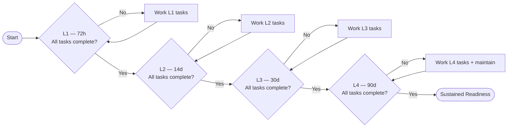

# 02 — Usage Guide


This guide describes how to use bePrepared on a daily, weekly, and monthly basis — both as a new user building readiness, and as an operator maintaining an established preparedness posture.

---

## Table of Contents

1. [First-Time Setup Workflow](#1-first-time-setup-workflow)
2. [Dashboard — Understanding Your Readiness Score](#2-dashboard--understanding-your-readiness-score)
3. [Daily Workflow](#3-daily-workflow)
4. [Weekly Workflow](#4-weekly-workflow)
5. [Monthly Workflow](#5-monthly-workflow)
6. [Scenario Switching](#6-scenario-switching)
7. [Building Readiness Level by Level](#7-building-readiness-level-by-level)
8. [Responding to Alerts](#8-responding-to-alerts)
9. [When an Emergency Actually Starts](#9-when-an-emergency-actually-starts)

---

## 1. First-Time Setup Workflow

Complete these steps in order on your first login:

```
1. Settings → Household
   ✓ Set your household name
   ✓ Set baseline target people count
   ✓ Review or edit people profiles

2. Settings → Planning Targets
   ✓ Review system defaults (water 4.0 L, calories 2200 kcal)
   ✓ Set household global overrides if needed
   ✓ Set shelter-in-place scenario overrides if needed
   ✓ Set evacuation scenario overrides if needed

3. Dashboard
   ✓ Confirm scenario is set correctly
   ✓ Review household totals preview (72h / 14d / 30d / 90d)

4. Ticksheets → Level 1 (72h)
   ✓ Work through all L1 tasks
   ✓ Mark completed items with evidence notes
   ✓ Identify gaps and prioritise acquisition

5. Inventory
   ✓ Add your current water and food stocks as lots
   ✓ Set expiry dates and replacement dates

6. Equipment
   ✓ Add durable equipment items (torches, radios, generator)
   ✓ Set up maintenance schedules
```

[↑ Go to TOC](#table-of-contents)

---

## 2. Dashboard — Understanding Your Readiness Score

The dashboard shows:

| Element             | Description                                                                        |
| ------------------- | ---------------------------------------------------------------------------------- |
| **Readiness Score** | % of tasks completed across all levels, weighted by level and life-safety category |
| **Active Scenario** | Current scenario (shelter/evacuation) with quick-switch button                     |
| **People in Use**   | Which profile is active and its source (auto/manual/baseline)                      |
| **Planning Totals** | Water and calorie requirements for 72h / 14d / 30d / 90d                           |
| **Stock vs Target** | Current inventory vs required totals for active scenario                           |
| **Alert Summary**   | Overdue → Due → Upcoming counts, with priority items listed                        |
| **Next Actions**    | Top 5 most impactful incomplete tasks                                              |
| **Level Progress**  | L1/L2/L3/L4 completion bars                                                        |

[↑ Go to TOC](#table-of-contents)

---

## 3. Daily Workflow

Estimated time: **2–5 minutes**

```
□ Open dashboard
□ Check alert summary — resolve any OVERDUE items immediately
□ Review "Next Actions" — complete quick tasks if possible
□ If new items consumed from inventory, update lots (qty or archive)
```

**Alert triage priority order:**

1. Medical (expired medications, overdue kit inspection)
2. Water (expired treatment supplies, low stock)
3. Power (overdue battery recharge, generator check)
4. Comms (overdue radio test)
5. Food, Shelter, Mobility, General

[↑ Go to TOC](#table-of-contents)

---

## 4. Weekly Workflow

Estimated time: **15–30 minutes**

```
□ Open Maintenance queue — complete all DUE items
  - Battery recharges
  - Equipment test runs
  - Generator starts
  - Radio checks

□ Open Inventory — check UPCOMING expiry list
  - Plan consumption of soon-expiring items
  - Add replacement lots when purchased

□ Open Ticksheets
  - Advance at least 1–2 incomplete tasks per week
  - Add evidence notes to completed items

□ Review Alerts — mark resolved where action is complete
```

[↑ Go to TOC](#table-of-contents)

---

## 5. Monthly Workflow

Estimated time: **1–2 hours**

```
□ Full inventory audit
  - Walk your storage and reconcile actual vs recorded qty
  - Archive consumed or disposed lots
  - Update next_replace_at dates if swapped

□ Rotate food stock
  - Move oldest lots to daily use
  - Add fresh lots to the back of storage (FIFO discipline)

□ Review settings
  - Is household people count still correct?
  - Are scenario overrides still appropriate for the season?
  - Adjust alert lead-time if needed

□ Maintenance history review
  - Check no schedules have been silently missed
  - Update meter readings for usage-based schedules

□ Readiness level review
  - Identify which L-level you are working on
  - Set a target for next month's new tasks

□ Household drill (at least quarterly)
  - Run through emergency action plan
  - Test evacuation time to rally point
  - Test comms between all household members
```

[↑ Go to TOC](#table-of-contents)

---

## 6. Scenario Switching

Switching scenario changes the following **immediately**:

1. Planning policy values (water L/day and kcal/day)
2. Active people profile (auto-switches to scenario-bound profile if one exists)
3. All requirement totals on dashboard and inventory gap views
4. Which tasks are shown (scenario-specific tasks filter in/out)

**To switch scenario:**

- Dashboard: click the scenario badge/button
- Settings → Household → Active Scenario dropdown

**Manual profile override:**

- Dashboard: click the people count → "Override" → enter number
- Active until you clear it or switch scenarios

[↑ Go to TOC](#table-of-contents)

---

## 7. Building Readiness Level by Level

Work through levels sequentially. Each level builds on the last.



**Practical pacing:**

- L1: 1–2 weekends to complete for most households
- L2: 2–4 weeks of incremental stocking and setup
- L3: 1–3 months to fully build out
- L4: 3–6 months to achieve; sustained effort ongoing

[↑ Go to TOC](#table-of-contents)

---

## 8. Responding to Alerts

### Expiry Alert

1. Locate the lot in Inventory
2. If usable — consume or rotate into daily use
3. Purchase replacement and add as new lot
4. Archive the old lot (mark as consumed)
5. Resolve the alert

### Replacement Cycle Alert

1. Locate the lot
2. Purchase new replacement stock
3. Add new lot with fresh `acquiredAt` and `nextReplaceAt`
4. Archive old lot
5. Resolve the alert

### Maintenance Due Alert

1. Locate the equipment item
2. Perform the maintenance task described
3. In Maintenance → Events → "Record Event"
4. System automatically advances `nextDueAt`
5. Alert auto-resolves

### Low Stock Alert

1. Review current lot totals vs target qty
2. Purchase and add new lot(s)
3. Alert auto-resolves when total meets threshold

[↑ Go to TOC](#table-of-contents)

---

## 9. When an Emergency Actually Starts

```
IMMEDIATE (first 10 minutes):
□ Switch dashboard to active scenario (shelter or evacuation)
□ Note which profile/people count is active — override if household count changed
□ Check alert queue for anything critical still pending
□ Print or screenshot current inventory totals for offline reference

SHELTER-IN-PLACE MODE:
□ Locate and verify water storage access
□ Confirm food and cooking fuel location
□ Activate backup power / confirm generator is ready
□ Establish household comms check-in schedule
□ Tune to emergency radio / weather band

EVACUATION MODE:
□ Grab pre-packed bug-out bags (L1 evacuation task)
□ Follow documented primary evacuation route
□ Report to pre-planned rally point
□ Contact out-of-area emergency contact
□ Carry offline copy of contacts / documents / meds list
```

See [Quickstart Operator Checklist](./13-quickstart-operator-checklist.md) for the printable one-page version.

[↑ Go to TOC](#table-of-contents)

---

_Content licensed under [CC BY-NC-SA 4.0](https://creativecommons.org/licenses/by-nc-sa/4.0/) · bePrepared Disaster Preparedness System_
