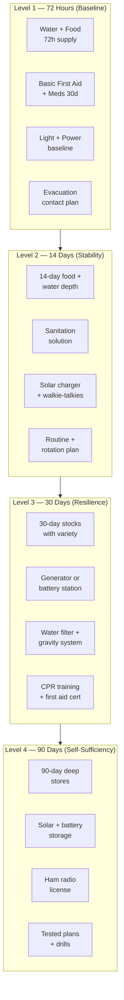
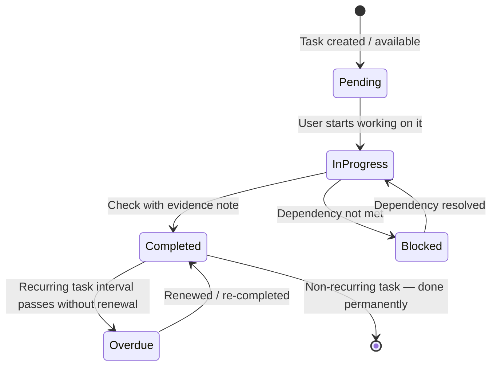

# 03 — Ticksheets and Progression


---

## Table of Contents

1. [What Is a Ticksheet?](#1-what-is-a-ticksheet)
2. [Task Classes](#2-task-classes)
3. [Readiness Levels](#3-readiness-levels)
4. [Task State Lifecycle](#4-task-state-lifecycle)
5. [Task Dependencies](#5-task-dependencies)
6. [Scenario Filtering](#6-scenario-filtering)
7. [Evidence Notes](#7-evidence-notes)
8. [Recurring Tasks](#8-recurring-tasks)
9. [Readiness Scoring](#9-readiness-scoring)
10. [Level Unlock Rules](#10-level-unlock-rules)

---

## 1. What Is a Ticksheet?

A ticksheet in bePrepared is a structured, hierarchical checklist that drives your household's preparedness progression. Unlike a flat to-do list, ticksheets:

- Are organised by preparedness module (Water, Food, Power, etc.)
- Are gated by readiness level (L1 → L4)
- Support dependencies (task B cannot be completed before task A)
- Track evidence (what was done, when, by whom, with notes)
- Include recurring tasks for ongoing operational discipline
- Are scenario-aware (shelter vs evacuation tasks differ)

[↑ Go to TOC](#table-of-contents)

---

## 2. Task Classes

Every task has a class that describes what kind of action it requires:

| Class | Description | Examples |
|-------|-------------|---------|
| `acquire` | Obtain a physical resource | Buy water containers, stock batteries |
| `prepare` | Organise, configure, or plan | Pack bug-out bag, identify safe room |
| `test` | Verify functionality through exercise | Run generator under load, conduct drill |
| `maintain` | Periodic upkeep | Rotate food stock, recharge batteries |
| `document` | Record important information | Write contact list, copy vital docs |

Filtering by class helps you batch similar work (e.g. a single shopping run for all `acquire` tasks).

[↑ Go to TOC](#table-of-contents)

---

## 3. Readiness Levels



[↑ Go to TOC](#table-of-contents)

---

## 4. Task State Lifecycle



**Blocked** tasks surface in the UI with a link to the dependency task. You cannot check a blocked task.

[↑ Go to TOC](#table-of-contents)

---

## 5. Task Dependencies

Dependencies enforce logical order. Example dependency chains:

```
"Store 14-day water supply"
    depends on →  "Store minimum 3-day water supply"

"Acquire portable water filter"  
    depends on →  "Acquire water purification tablets"

"Conduct comms test across all devices"
    depends on →  "Acquire FRS/GMRS walkie-talkies"
    depends on →  "Acquire battery-powered radio"
```

Dependencies are shown on the task detail page. The Ticksheet view highlights blocked items in amber.

[↑ Go to TOC](#table-of-contents)

---

## 6. Scenario Filtering

Tasks have a scenario attribute:

| Value | Behaviour |
|-------|-----------|
| `both` | Always shown regardless of active scenario |
| `shelter_in_place` | Only shown in shelter-in-place scenario view |
| `evacuation` | Only shown in evacuation scenario view |

Switching scenario on the dashboard instantly re-filters all ticksheets to relevant tasks.

[↑ Go to TOC](#table-of-contents)

---

## 7. Evidence Notes

Every task has an optional `evidencePrompt` that tells you what to record when completing it. Examples:

- "How many litres stored? Where?"
- "Model and filter capacity?"
- "Drill date and time to rally point?"

Evidence notes serve as:
- Proof of completion for your own audit trail
- Reference data when you return to a task months later
- A record for other household members

[↑ Go to TOC](#table-of-contents)

---

## 8. Recurring Tasks

Tasks marked `isRecurring = true` automatically create a new `Pending` progress entry after the `recurDays` interval passes since the last completion. Examples:

| Task | Recur Interval |
|------|---------------|
| Rotate food stock | 90 days |
| Water storage rotation | 180 days |
| Maintain vehicle fuel above half-tank | 30 days |
| Battery storage recharge | 90 days |
| Full household drill | 180 days |

Overdue recurring tasks appear in the alert queue with `severity: overdue`.

[↑ Go to TOC](#table-of-contents)

---

## 9. Readiness Scoring

The readiness score is computed as:

```
score = Σ (completed_tasks × weight) / Σ (all_tasks × weight) × 100
```

Weight factors:
- **Life-safety category multiplier**: Water/Medical = 2x, Power/Comms = 1.5x, other = 1x
- **Level multiplier**: L1 = 4x, L2 = 3x, L3 = 2x, L4 = 1x (baseline is weighted higher)
- **Recurring task recency**: Full weight if current; decays toward 0 if overdue

Score bands:

| Score | Band | Meaning |
|-------|------|---------|
| 0–20% | 🔴 Critical | L1 incomplete |
| 21–50% | 🟠 Building | L1 done, working L2 |
| 51–75% | 🟡 Stable | L2 done, working L3 |
| 76–90% | 🔵 Resilient | L3 done, working L4 |
| 91–100% | 🟢 Self-Sufficient | L4 complete, maintained |

[↑ Go to TOC](#table-of-contents)

---

## 10. Level Unlock Rules

A readiness level is considered "unlocked" (accessible for progression tracking) when:

- All non-recurring tasks at the preceding level are `Completed`
- All recurring tasks at the preceding level have been completed at least once

This means:
- You cannot claim L2 readiness until all L1 tasks are done
- Completing L3 tasks before L2 is done does not contribute to your L2 score
- The dashboard clearly shows which tasks are blocking your current level

[↑ Go to TOC](#table-of-contents)

---

*Content licensed under [CC BY-NC-SA 4.0](https://creativecommons.org/licenses/by-nc-sa/4.0/) · bePrepared Disaster Preparedness System*
