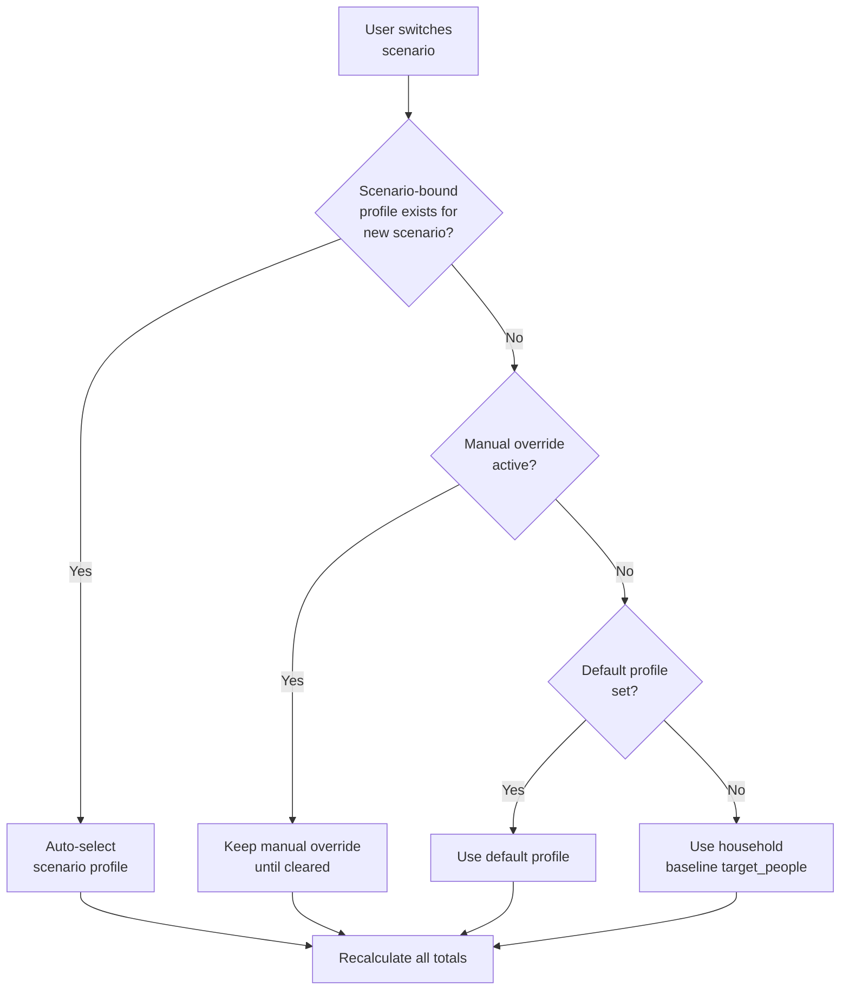

# 04 — Settings and Overrides


---

## Table of Contents

1. [Settings Overview](#1-settings-overview)
2. [Household Settings](#2-household-settings)
3. [People Profiles](#3-people-profiles)
4. [Scenario Auto-Switch Logic](#4-scenario-auto-switch-logic)
5. [Planning Targets — Global Overrides](#5-planning-targets--global-overrides)
6. [Planning Targets — Scenario Overrides](#6-planning-targets--scenario-overrides)
7. [Override Precedence Reference](#7-override-precedence-reference)
8. [Alert and Lifecycle Settings](#8-alert-and-lifecycle-settings)
9. [Policy Audit Log](#9-policy-audit-log)
10. [Resetting to Defaults](#10-resetting-to-defaults)

---

## 1. Settings Overview

Settings are organised under four tabs in `Settings`:

| Tab                  | Contains                                                                  |
| -------------------- | ------------------------------------------------------------------------- |
| **Household**        | Name, baseline people, active scenario, active profile                    |
| **People Profiles**  | Create/edit/delete named occupancy profiles, scenario binding             |
| **Planning Targets** | Water and calorie defaults; global overrides; scenario-specific overrides |
| **Lifecycle**        | Alert lead-time, grace window, maintenance defaults                       |

All changes are written to the database immediately with audit timestamps.

[↑ Go to TOC](#table-of-contents)

---

## 2. Household Settings

| Field                      | Type        | Notes                              |
| -------------------------- | ----------- | ---------------------------------- |
| **Household name**         | Text        | Display label only                 |
| **Baseline target people** | Integer ≥ 1 | Used when no profile is active     |
| **Active scenario**        | Enum        | `shelter_in_place` or `evacuation` |
| **Active profile**         | Profile ID  | Set automatically or manually      |

The baseline target people is the **last resort** fallback in the people count resolution chain. It should reflect your normal household occupancy.

[↑ Go to TOC](#table-of-contents)

---

## 3. People Profiles

Profiles let you define **named occupancy sets** for different situations.

### Profile Fields

| Field              | Description                                                              |
| ------------------ | ------------------------------------------------------------------------ |
| **Name**           | Display label (e.g. "Normal — 2 people", "Extended family — 5")          |
| **People count**   | Integer ≥ 1                                                              |
| **Default**        | Boolean — marks this as the fallback profile when no scenario is matched |
| **Scenario bound** | Optional: `shelter_in_place` or `evacuation`                             |
| **Notes**          | Free-text context                                                        |

### Example Profile Configuration

```
Profile 1: "Normal — 2 people"
  people_count: 2
  is_default: true
  scenario_bound: null
  → Used for all scenarios unless a bound profile matches

Profile 2: "Evacuation — 2 people"
  people_count: 2
  is_default: false
  scenario_bound: evacuation
  → Auto-selected when scenario switches to 'evacuation'

Profile 3: "Extended family — 5 people"
  people_count: 5
  is_default: false
  scenario_bound: null
  → Manually selected when extended family is sheltering with you
```

[↑ Go to TOC](#table-of-contents)

---

## 4. Scenario Auto-Switch Logic



**Manual override** persists until:

- User explicitly clears it (click "Clear override" button on dashboard)
- User switches scenario and a bound profile exists for the new scenario

**When manual override is active**, the dashboard shows a banner:

> ⚠ Manual people override active: 3 people — [Clear]

[↑ Go to TOC](#table-of-contents)

---

## 5. Planning Targets — Global Overrides

Global overrides apply to **all scenarios** unless a scenario-specific override exists.

### Configurable Keys

| Key                                | Default | Unit            | UI Label         |
| ---------------------------------- | ------- | --------------- | ---------------- |
| `water_liters_per_person_per_day`  | 4.0     | L/person/day    | Water target     |
| `calories_kcal_per_person_per_day` | 2200    | kcal/person/day | Calorie target   |
| `alert_upcoming_days`              | 14      | days            | Upcoming window  |
| `alert_grace_days`                 | 3       | days            | Due grace window |

### UI Behaviour

- Current effective value shown alongside input (indicating which tier it comes from)
- On change: archive old override row, insert new row (full audit trail)
- "Reset to default" button: archives the override row, reverts to system default

[↑ Go to TOC](#table-of-contents)

---

## 6. Planning Targets — Scenario Overrides

Scenario overrides are set per scenario tab in `Settings → Planning Targets`.

### When to Use Scenario Overrides

| Scenario         | Typical Overrides                       | Reason                               |
| ---------------- | --------------------------------------- | ------------------------------------ |
| Shelter-in-Place | Water: 5.0–6.0 L (if sanitation needed) | Home toilet bucket flush adds demand |
| Shelter-in-Place | Calories: 2000 (less active)            | Sedentary home confinement           |
| Evacuation       | Water: 3.0–3.5 L (carry constraint)     | Weight limitations                   |
| Evacuation       | Calories: 2400–2600 (more active)       | Travel, stress, physical exertion    |

### Preview

The settings page shows a **live preview** as you type:

```
Evacuation — 3 people
Water: 3.5 L/person/day
Calories: 2400 kcal/person/day

┌──────────────────────────────────────────────────────────┐
│ Horizon │ Water Required │ Calories Required             │
├─────────┼────────────────┼───────────────────────────────┤
│ 72 hrs  │ 31.5 L         │ 21,600 kcal                   │
│ 14 days │ 147.0 L        │ 100,800 kcal                  │
│ 30 days │ 315.0 L        │ 216,000 kcal                  │
│ 90 days │ 945.0 L        │ 648,000 kcal                  │
└──────────────────────────────────────────────────────────┘
```

[↑ Go to TOC](#table-of-contents)

---

## 7. Override Precedence Reference

```
For any policy key + scenario:

  PRIORITY 1 → scenario_policies WHERE household_id = X AND scenario = Y AND key = Z
  PRIORITY 2 → household_policies WHERE household_id = X AND key = Z
  PRIORITY 3 → policy_defaults WHERE key = Z
```

The API endpoint `GET /planning/:householdId/:scenario` returns the effective value with a `source` field indicating which tier was used.

[↑ Go to TOC](#table-of-contents)

---

## 8. Alert and Lifecycle Settings

| Key                   | Default | Meaning                                             |
| --------------------- | ------- | --------------------------------------------------- |
| `alert_upcoming_days` | 14      | Alert fires this many days before due date          |
| `alert_grace_days`    | 3       | Alert escalates to overdue this many days after due |

Both are household-level configurable keys under Planning Targets → Global.

**Conservative settings (recommended for critical items):**

- Upcoming: 30 days — more lead time to act
- Grace: 1 day — faster escalation to overdue

[↑ Go to TOC](#table-of-contents)

---

## 9. Policy Audit Log

Every policy change creates an entry in `audit_log`:

| Field      | Value                                       |
| ---------- | ------------------------------------------- |
| entity     | `household_policies` or `scenario_policies` |
| action     | `update`                                    |
| old_value  | Previous value                              |
| new_value  | New value                                   |
| created_at | UTC timestamp                               |

View at `Settings → Audit Log`. This is read-only and cannot be edited or deleted.

[↑ Go to TOC](#table-of-contents)

---

## 10. Resetting to Defaults

To reset **any** household or scenario override:

1. Navigate to `Settings → Planning Targets`
2. Click "Reset to default" next to the overridden field
3. System archives the override row
4. Value immediately reverts to system default
5. Audit log entry created

To reset **all** overrides for a household:

- Use `DELETE /settings/:householdId/policies/:key` per key
- Or use the "Reset all to defaults" button in Settings (archives all active overrides)

[↑ Go to TOC](#table-of-contents)

---

_Content licensed under [CC BY-NC-SA 4.0](https://creativecommons.org/licenses/by-nc-sa/4.0/) · bePrepared Disaster Preparedness System_
