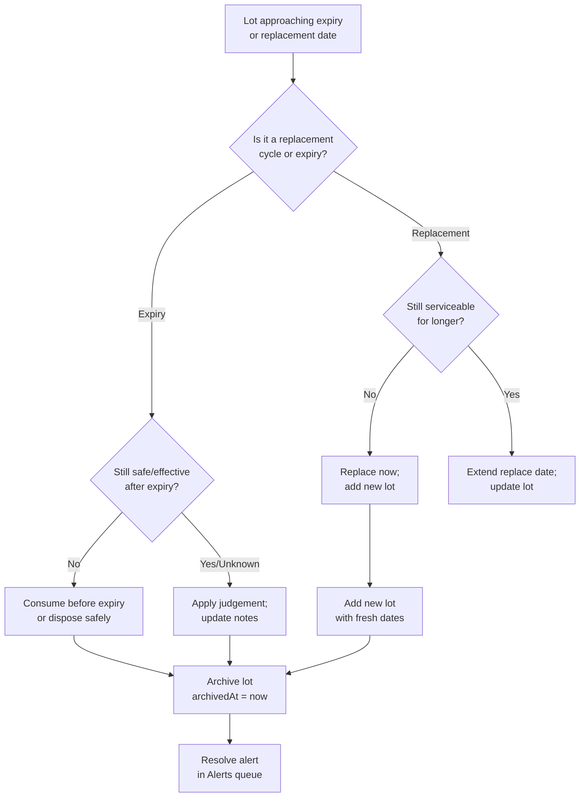

# 05 — Inventory, Replacement, and Expiry


---

## Table of Contents

1. [Inventory Model Overview](#1-inventory-model-overview)
2. [Items vs Lots](#2-items-vs-lots)
3. [Expiry Tracking](#3-expiry-tracking)
4. [Replacement Cycles](#4-replacement-cycles)
5. [Stock Adequacy (Gap Analysis)](#5-stock-adequacy-gap-analysis)
6. [FIFO Rotation Strategy](#6-fifo-rotation-strategy)
7. [Inventory Lifecycle Decision Flow](#7-inventory-lifecycle-decision-flow)
8. [Archiving and Restore](#8-archiving-and-restore)
9. [Inventory Categories](#9-inventory-categories)
10. [Best Practice: Stocking by Level](#10-best-practice-stocking-by-level)

---

## 1. Inventory Model Overview

The inventory system manages two layers:

- **Items**: What you stock (e.g. "Bottled water 1.5L", "Canned beans")
- **Lots**: Physical batches of an item with quantities, expiry dates, and replacement tracking

This separation allows you to track multiple purchase batches (lots) of the same item with different expiry dates — critical for accurate rotation management.

[↑ Go to TOC](#table-of-contents)

---

## 2. Items vs Lots

### Inventory Item (the "type")

| Field                  | Description                                               |
| ---------------------- | --------------------------------------------------------- |
| `name`                 | What the item is                                          |
| `unit`                 | Measurement unit (L, kg, units, days)                     |
| `category`             | Category (water-storage, food-staples, medical-otc, etc.) |
| `location`             | Where it's stored                                         |
| `target_qty`           | How much you want to have on hand                         |
| `low_stock_threshold`  | Alert threshold (qty below this triggers low-stock alert) |
| `default_replace_days` | Default replacement cycle in days                         |
| `is_tracked_by_expiry` | Whether lots should have expiry dates                     |

### Inventory Lot (a physical batch)

| Field             | Description                                    |
| ----------------- | ---------------------------------------------- |
| `qty`             | Quantity in item's unit                        |
| `acquired_at`     | Date purchased/received                        |
| `expires_at`      | Hard expiry date (food, meds, water treatment) |
| `replace_days`    | Override replacement cycle for this lot        |
| `next_replace_at` | Calculated date: acquired_at + replace_days    |
| `batch_ref`       | Optional label (e.g. purchase receipt, brand)  |

[↑ Go to TOC](#table-of-contents)

---

## 3. Expiry Tracking

Expiry tracking is for items with a **hard shelf life** that renders them unsafe or ineffective after a date, regardless of how much is left.

Examples:

- Water purification tablets (Aquatabs: 5-year shelf life)
- Prescription medications
- OTC medications (aspirin, antihistamines)
- Packaged food with printed use-by dates
- Chemical lightsticks
- Specific first aid items (wound closure strips, eye wash)

**Expiry alerts fire:**

- `upcoming`: `expires_at` is within `alert_upcoming_days` from today
- `due`: `expires_at` is today
- `overdue`: `expires_at` is in the past

[↑ Go to TOC](#table-of-contents)

---

## 4. Replacement Cycles

Replacement cycles are for items that should be swapped on a **time interval** — not because they've expired, but to ensure reliability, freshness, or potency.

Examples:

| Item                      | Replacement Cycle | Rationale                                                                      |
| ------------------------- | ----------------- | ------------------------------------------------------------------------------ |
| Bottled water             | 12 months         | Taste/container integrity (water itself doesn't expire but containers degrade) |
| Fuel stabiliser + fuel    | 12–24 months      | Fuel degradation                                                               |
| Fire extinguisher         | 72 months (6 yrs) | Pressurised container reliability                                              |
| Cash reserve              | Annually          | Review denomination mix and bills                                              |
| AA/AAA alkaline batteries | 36–60 months      | Shelf-life management                                                          |
| Food general stores       | 12–24 months      | Nutrient and taste quality                                                     |

**Replacement alerts fire when `next_replace_at` is approaching**, using the same upcoming/due/overdue severity model as expiry alerts.

[↑ Go to TOC](#table-of-contents)

---

## 5. Stock Adequacy (Gap Analysis)

The inventory gap analysis compares:

```
gap = target_qty - sum(active_lot_qty WHERE item_id = X)
```

Where `target_qty` is set on the item and ideally equals the household requirement for the target horizon (calculated from effective policy and people count).

Gap display on dashboard and inventory pages:

| Status      | Meaning                                            |
| ----------- | -------------------------------------------------- |
| ✅ Adequate | Current qty ≥ target_qty                           |
| 🟡 Low      | Current qty ≥ low_stock_threshold but < target_qty |
| 🔴 Critical | Current qty < low_stock_threshold                  |
| ⬜ Not Set  | No target_qty configured                           |

[↑ Go to TOC](#table-of-contents)

---

## 6. FIFO Rotation Strategy

FIFO (First In, First Out) is the standard rotation method:

```
Add new stock to the back → consume from the front

Storage shelf:
  [ OLDEST LOT → consume first ] → ... → [ NEWEST LOT → consume last ]
```

**In bePrepared:**

- Lots are sortable by `acquired_at` and `expires_at`
- The "consume next" lot is the one with the earliest expiry or acquisition date
- Archive a lot (qty → 0) when it is fully consumed
- Add a new lot when purchasing replacement stock

**Monthly rotation task:**

- Identify lots expiring within 90 days
- Move these to daily use rotation
- Replace with fresh stock
- Update lot records

[↑ Go to TOC](#table-of-contents)

---

## 7. Inventory Lifecycle Decision Flow



[↑ Go to TOC](#table-of-contents)

---

## 8. Archiving and Restore

Lots are never hard-deleted. They are **archived** (`archived_at` timestamp set).

**Archive reasons:**

- Lot fully consumed (normal use)
- Lot disposed (expired, damaged)
- Lot replaced (superseded by newer lot — `replaced_by_lot_id` set)

**Restore flow:**

1. Navigate to Inventory → Item → Archived Lots
2. Click "Restore" on the lot
3. `archived_at` is cleared; lot re-appears in active lot list
4. Update qty and dates as needed

[↑ Go to TOC](#table-of-contents)

---

## 9. Inventory Categories

| Slug                     | Category                               |
| ------------------------ | -------------------------------------- |
| `water-storage`          | Water Storage                          |
| `water-treatment`        | Water Treatment                        |
| `food-staples`           | Food — Staples (rice, oats, pasta)     |
| `food-canned`            | Food — Canned                          |
| `food-freeze-dried`      | Food — Freeze-Dried                    |
| `food-supplements`       | Food — Supplements                     |
| `medical-first-aid`      | Medical — First Aid                    |
| `medical-rx`             | Medical — Prescriptions                |
| `medical-otc`            | Medical — OTC Medications              |
| `fuel`                   | Fuel                                   |
| `batteries-primary`      | Batteries — Primary (alkaline/lithium) |
| `batteries-rechargeable` | Batteries — Rechargeable               |
| `hygiene`                | Hygiene Supplies                       |
| `sanitation`             | Sanitation Supplies                    |
| `lighting`               | Lighting                               |
| `comms`                  | Communications                         |
| `tools`                  | Tools and Hardware                     |
| `documents`              | Documents and Records                  |
| `cash`                   | Cash Reserves                          |
| `clothing`               | Clothing and Warmth                    |

[↑ Go to TOC](#table-of-contents)

---

## 10. Best Practice: Stocking by Level

Use these targets as your lot `target_qty` baseline:

**L1 (72h) — 4 people, defaults:**

- Water: 48 L total
- Calories: 26,400 kcal (approx. 22+ canned meals + staples)

**L2 (14d) — 4 people, defaults:**

- Water: 224 L total
- Calories: 123,200 kcal

**L3 (30d) — 4 people, defaults:**

- Water: 480 L total
- Calories: 264,000 kcal

**L4 (90d) — 4 people, defaults:**

- Water: 1,440 L total
- Calories: 792,000 kcal (~360 kg of rice-equivalent dry goods)

[↑ Go to TOC](#table-of-contents)

---

_Content licensed under [CC BY-NC-SA 4.0](https://creativecommons.org/licenses/by-nc-sa/4.0/) · bePrepared Disaster Preparedness System_
