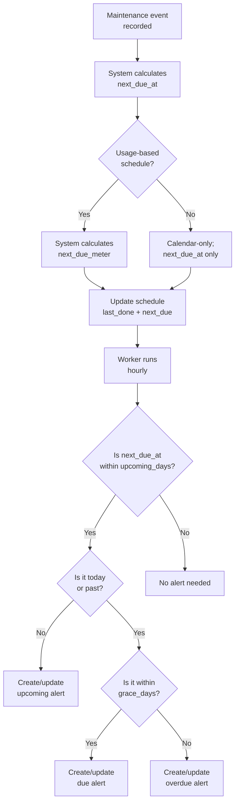

# 06 — Maintenance Management


---

## Table of Contents

1. [Why Maintenance Management Matters](#1-why-maintenance-management-matters)
2. [Equipment Items](#2-equipment-items)
3. [Battery Profiles](#3-battery-profiles)
4. [Maintenance Templates](#4-maintenance-templates)
5. [Maintenance Schedules](#5-maintenance-schedules)
6. [Recording Maintenance Events](#6-recording-maintenance-events)
7. [Calendar vs Usage-Based Scheduling](#7-calendar-vs-usage-based-scheduling)
8. [Maintenance Scheduling Flow](#8-maintenance-scheduling-flow)
9. [Default Maintenance Intervals](#9-default-maintenance-intervals)
10. [Maintenance Queue and Alerts](#10-maintenance-queue-and-alerts)

---

## 1. Why Maintenance Management Matters

In a disaster, equipment must work on first use. The most common preparedness failure mode is not missing equipment — it is equipment that fails when needed because it was not maintained.

Common failures from lack of maintenance:
- Generator that won't start (stale fuel, seized carb, dead battery)
- Water filter with degraded/expired element
- Li-Ion power banks that have deep-discharged and cannot recover
- Radio with dead batteries
- First aid kit with expired wound closures and no gloves

bePrepared's maintenance system ensures every piece of critical equipment has a documented, scheduled service cadence.

[↑ Go to TOC](#table-of-contents)

---

## 2. Equipment Items

Equipment items are **durable assets** — gear that lasts multiple years and requires periodic service rather than replacement.

| Field | Description |
|-------|-------------|
| `name` | Item description |
| `category_slug` | Equipment category (power, water, comms, medical, etc.) |
| `model` | Manufacturer model (optional) |
| `serial_no` | Serial number for warranty/service records |
| `location` | Where it's stored |
| `status` | `operational` / `needs_service` / `unserviceable` / `retired` |
| `acquired_at` | Purchase date (helps estimate warranty windows) |

Equipment categories: `power`, `water`, `comms`, `medical`, `shelter`, `mobility`, `security`, `batteries`, `general`

[↑ Go to TOC](#table-of-contents)

---

## 3. Battery Profiles

Battery profiles capture chemistry-specific management rules. The system ships with these defaults:

| Profile | Chemistry | Shelf Life | Recheck Cycle | Storage Notes |
|---------|-----------|-----------|---------------|---------------|
| Alkaline AA/AAA | Alkaline | 10 years | 12 months | Inspect for leakage; store at room temp |
| Lithium Primary | lithium_primary | 10 years | 12 months | Excellent cold-weather; ideal for critical devices |
| Li-Ion Rechargeable | liion | 2 years | 3 months | Store at 40–60% charge; recharge every 90 days |
| NiMH Rechargeable | nimh | 1 year | 3 months | Higher self-discharge; check and recharge quarterly |
| Lead-Acid 12V | lead_acid | 1 year | 1 month | Check charge monthly; keep terminals clean |

**Battery best practices:**

1. **Li-Ion storage**: Never store at 100% or 0%. Target 40–60% charge for long-term storage. A battery stored at full charge degrades significantly over 6 months.

2. **Lead-acid maintenance**: Sulphation (irreversible degradation) begins within weeks if left discharged. Monthly charge checks are non-negotiable.

3. **Alkaline in cold weather**: At −20°C, alkaline batteries deliver ~50% rated capacity. Lithium primary cells perform near full rated capacity.

4. **Mixed battery banks**: Never mix old and new batteries in a series configuration. The weakest cell limits total capacity.

[↑ Go to TOC](#table-of-contents)

---

## 4. Maintenance Templates

Templates define reusable maintenance task definitions that can be applied to any equipment item in the same category.

| Field | Description |
|-------|-------------|
| `category_slug` | What kind of equipment this applies to |
| `name` | Short name for the maintenance action |
| `task_type` | `inspect` / `clean` / `lubricate` / `test` / `full_service` / `recharge` / `replace` |
| `default_cal_days` | Default calendar interval in days |
| `usage_meter_unit` | Optional: `hours`, `cycles`, `km` |
| `default_usage_interval` | Usage interval value |
| `grace_days` | Grace window before escalating to overdue |

When you add a maintenance schedule to an equipment item, you can link it to a template (inheriting defaults) or define a custom schedule from scratch.

[↑ Go to TOC](#table-of-contents)

---

## 5. Maintenance Schedules

A schedule ties a specific equipment item to a specific maintenance cadence.

| Field | Description |
|-------|-------------|
| `equipment_item_id` | The item being maintained |
| `name` | Descriptive label |
| `cal_days` | Calendar interval (overrides template default) |
| `usage_meter_unit` | Optional usage unit |
| `usage_interval` | Trigger usage value |
| `grace_days` | Overdue grace window |
| `last_done_at` | Date of last completed maintenance |
| `last_meter_value` | Meter reading at last maintenance |
| `next_due_at` | Calculated next due date |
| `next_due_meter` | Calculated next due meter value |
| `is_active` | Toggle to pause a schedule without archiving |

Multiple schedules can exist per item (e.g. a generator might have both a "quarterly test run" and an "annual full service" schedule).

[↑ Go to TOC](#table-of-contents)

---

## 6. Recording Maintenance Events

When you complete a maintenance task:

1. Navigate to `Maintenance → Due Queue` (or Equipment → Item → Schedules)
2. Click **"Record Event"** on the schedule
3. Enter:
   - Date performed (defaults to today)
   - Performed by (optional)
   - Meter reading (if usage-based)
   - Notes (findings, parts replaced, issues noted)
4. Submit — system automatically:
   - Creates a `maintenance_event` record
   - Advances `next_due_at` by the calendar interval from `performed_at`
   - Updates `last_done_at` and `last_meter_value`
   - Resolves any existing alert for this schedule

[↑ Go to TOC](#table-of-contents)

---

## 7. Calendar vs Usage-Based Scheduling

### Calendar-Based
Trigger is purely time: "Every 90 days from last service"

Best for:
- Items in standby storage (batteries, fire extinguishers)
- Items where time degrades performance regardless of use (fuel stabiliser, filters)
- Fixed inspection cadences (smoke detectors, first aid kits)

### Usage-Based
Trigger is accumulated use: "Every 100 hours / 50 cycles / 5,000 km"

Best for:
- Generators (hours run)
- Portable stoves (burner cycles)
- Water pump filters (litres pumped)
- Vehicles (kilometres driven)

### Both Together
A schedule can have both calendar and usage triggers. The alert fires **whichever occurs first**. Example:

```
Generator full service:
  Calendar:  Every 365 days
  Usage:     Every 100 hours of runtime
  
  → Alerts when either 365 days pass OR 100 hours accumulated
```

[↑ Go to TOC](#table-of-contents)

---

## 8. Maintenance Scheduling Flow



[↑ Go to TOC](#table-of-contents)

---

## 9. Default Maintenance Intervals

| Equipment | Task | Interval | Grace |
|-----------|------|----------|-------|
| Generator | Test run | 90 days | 7 days |
| Generator | Full service | 365 days | 14 days |
| Water filter | Inspection | 90 days | 14 days |
| Water filter | Full service | 365 days | 14 days |
| Solar panel | Cleaning | 90 days | 14 days |
| Inverter | Inspection | 180 days | 14 days |
| Li-Ion battery | Storage recharge | 90 days | 7 days |
| Lead-acid battery | Charge check | 30 days | 5 days |
| Battery bank | Capacity test | 180 days | 14 days |
| Radio | Test + battery check | 90 days | 7 days |
| First aid kit | Inspection | 90 days | 14 days |
| AED | Inspection | 90 days | 7 days |
| Vehicle kit | Inspection | 180 days | 14 days |
| Vehicle fuel | Level check | 30 days | 5 days |
| Fire extinguisher | Inspection | 365 days | 14 days |
| Smoke detector | Test | 90 days | 7 days |
| Emergency binder | Review | 180 days | 14 days |
| Household drill | Full exercise | 180 days | 30 days |

All intervals are editable per schedule.

[↑ Go to TOC](#table-of-contents)

---

## 10. Maintenance Queue and Alerts

The maintenance queue (accessible from the dashboard and `Maintenance` nav item) shows:

| Queue | Filter |
|-------|--------|
| **Overdue** | `next_due_at` < today − grace_days |
| **Due today** | `next_due_at` = today |
| **Due this week** | `next_due_at` within 7 days |
| **Upcoming** | `next_due_at` within `alert_upcoming_days` |

Each queue item shows: equipment name, schedule name, due date, days overdue/remaining, and a one-click "Record Event" button.

[↑ Go to TOC](#table-of-contents)

---

*Content licensed under [CC BY-NC-SA 4.0](https://creativecommons.org/licenses/by-nc-sa/4.0/) · bePrepared Disaster Preparedness System*
