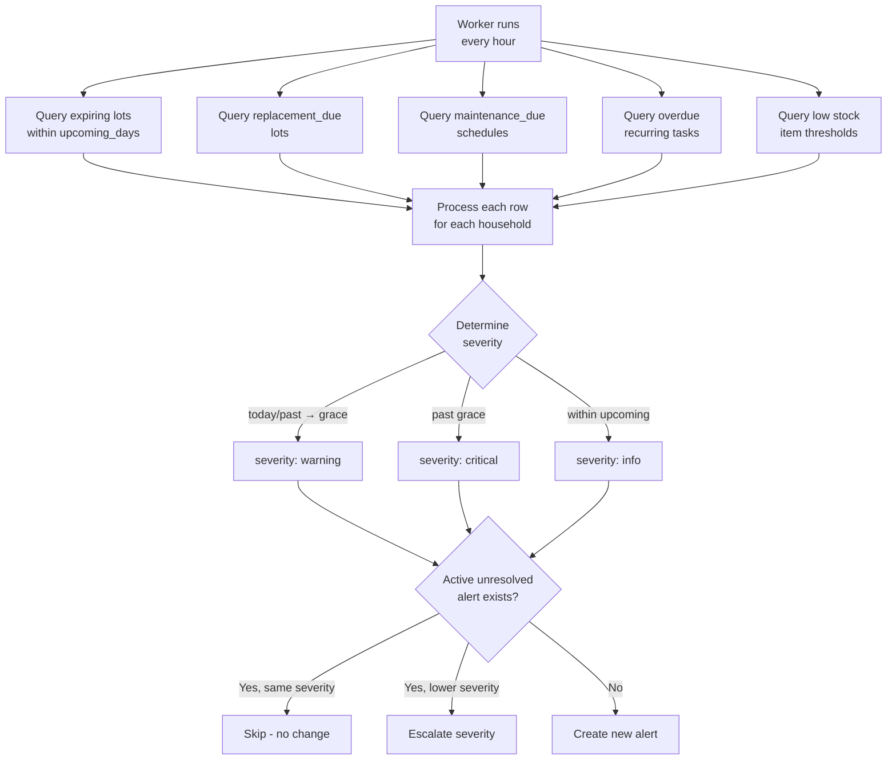
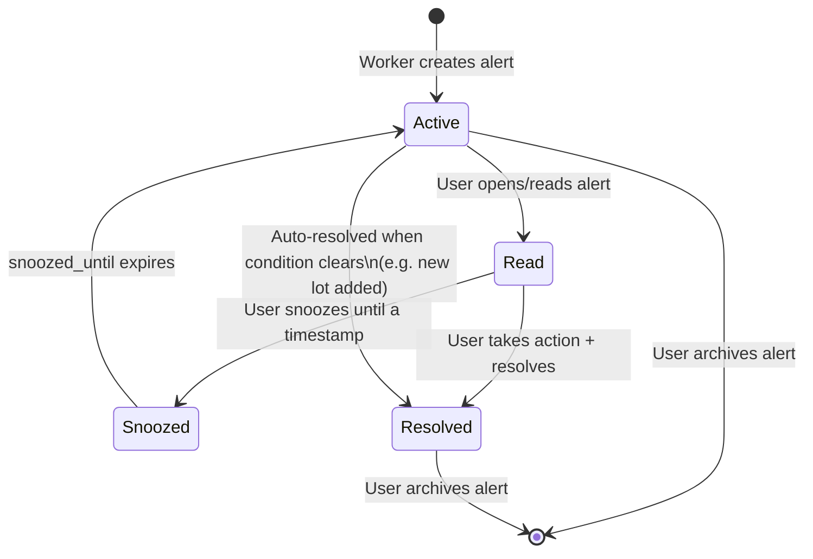

# 07 — Alerting and Prioritization


---

## Table of Contents

1. [Alert System Overview](#1-alert-system-overview)
2. [Alert Severity Model](#2-alert-severity-model)
3. [Alert Categories](#3-alert-categories)
4. [Alert Generation Pipeline](#4-alert-generation-pipeline)
5. [Priority Ranking Algorithm](#5-priority-ranking-algorithm)
6. [Alert Lifecycle (Statuses)](#6-alert-lifecycle-statuses)
7. [Duplicate Prevention](#7-duplicate-prevention)
8. [Triage Process](#8-triage-process)
9. [Alert Settings](#9-alert-settings)

---

## 1. Alert System Overview

The alert system is the **operational heartbeat** of bePrepared. It continuously monitors:
- Inventory lot expiry dates
- Inventory lot replacement cycles
- Maintenance schedule due dates
- Task overdue states
- Low stock levels

Alerts are generated by the background **worker** process (running on an hourly schedule) and surfaced on the dashboard and dedicated Alerts page.

[↑ Go to TOC](#table-of-contents)

---

## 2. Alert Severity Model

```
[ alert_upcoming_days before due ]───►[ DUE DATE ]──[ grace_days ]──►[ OVERDUE ]
         UPCOMING                           DUE                          OVERDUE
    (informational)                    (action needed)               (critical)
```

| Time Stage | Trigger | Default Severity | UI Colour | Dashboard Priority |
|------------|---------|------------------|-----------|-------------------|
| `upcoming` | Within `alert_upcoming_days` days of due | `info` | Blue | Plan ahead |
| `due` | On or after due date, within grace window | `warning` | Amber | Act now |
| `overdue` | Past due date + grace window | `critical` | Red | Resolve immediately |

Persisted alert severity values are `info`, `warning`, and `critical`.

**Default windows:**
- Upcoming: 14 days ahead
- Grace: 3 days past due

Both are configurable in Settings.

[↑ Go to TOC](#table-of-contents)

---

## 3. Alert Categories

| Category | Source | Example |
|----------|--------|---------|
| `expiry` | `inventory_lots.expires_at` | "Water purification tablets expiring in 8 days" |
| `replacement_due` | `inventory_lots.next_replace_at` | "Stored water replacement due in 12 days" |
| `maintenance_due` | `maintenance_schedules.next_due_at` | "Generator test run overdue by 5 days" |
| `low_stock` | `sum(lot qty) < item.low_stock_threshold` | "Bottled water below minimum threshold" |
| `task_overdue` | `task_progress.next_due_at` (recurring) | "Monthly fuel level check overdue" |
| `custom` | user-created alert (`POST /alerts/:householdId`) | "Check propane level" |

[↑ Go to TOC](#table-of-contents)

---

## 4. Alert Generation Pipeline



[↑ Go to TOC](#table-of-contents)

---

## 5. Priority Ranking Algorithm

When the dashboard shows "Top 5 most urgent alerts", they are ranked by:

```
priority_score = severity_weight × life_safety_weight × staleness_factor
```

**Severity weights:**
- `critical` = 1000
- `warning`  = 100
- `info`     = 10

**Life-safety category weights:**
- `medical` (medications, first aid kit) = 5x
- `water` (storage, treatment)           = 4x
- `power` (batteries, generator)         = 3x
- `comms` (radio, walkie-talkies)        = 3x
- `food`                                 = 2x
- `sanitation`, `shelter`                = 2x
- `mobility`, `security`, `general`     = 1x

**Staleness factor:**
- Days overdue / total alert_upcoming_days (linear 1.0 → 2.0 as overdue accumulates)

**Example rankings:**

| Alert | Severity | Category Weight | Score |
|-------|----------|----------------|-------|
| Medications expired 2 days ago | critical | medical 5x | 5000 |
| Water filter maintenance overdue 1 day | critical | water 4x | 4000 |
| Generator service due tomorrow | warning | power 3x | 300 |
| Food rotation upcoming in 7 days | info | food 2x | 20 |

[↑ Go to TOC](#table-of-contents)

---

## 6. Alert Lifecycle (Statuses)



**Alert fields:**

| Field | Description |
|-------|-------------|
| `status` | `active`, `read`, `resolved`, or `snoozed` |
| `snoozed_until` | UTC timestamp after which alert returns to active |
| `read_at` | UTC timestamp when first read |
| `resolved_at` | UTC timestamp of resolution |
| `archived_at` | Soft-archived (dismissed or auto-cleaned) |

[↑ Go to TOC](#table-of-contents)

---

## 7. Duplicate Prevention

The worker uses a **dedupe-key upsert** approach:

```
For each candidate alert (household + type + entity + due window):
  IF alert exists with same dedupe_key:
    IF new severity > existing severity → UPDATE severity and timestamps
    ELSE                               → SKIP (no duplicate)
  ELSE:
    INSERT new alert
```

This prevents the alert queue from flooding with duplicate entries on each hourly run.

[↑ Go to TOC](#table-of-contents)

---

## 8. Triage Process

When reviewing alerts, apply this triage order:

```
Step 1: Sort by OVERDUE first, then DUE, then UPCOMING

Step 2: Within OVERDUE, sort by life-safety weight:
  → Medical overdue first
  → Water overdue second
  → Power/Comms overdue third
  → Others

Step 3: For each alert, take the minimum required action:
  → Expiry:      Consume or dispose + purchase replacement
  → Replacement: Purchase replacement + update lot
  → Maintenance: Perform task + record event
  → Low stock:   Purchase + add lot
  → Task overdue: Complete task + record evidence
  
Step 4: Resolve the alert in the system (click "Resolve")

Step 5: Re-check dashboard — confirm score improves
```

[↑ Go to TOC](#table-of-contents)

---

## 9. Alert Settings

| Setting | Location | Default |
|---------|----------|---------|
| Upcoming lead time | Settings → Planning Targets → `alert_upcoming_days` | 14 days |
| Grace window | Settings → Planning Targets → `alert_grace_days` | 3 days |
| Worker run interval | Environment variable `WORKER_INTERVAL_MS` | 3600000 (1 hour) |

**Recommended production settings:**
- `alert_upcoming_days`: 30 days for critical items (medical, water)
- `alert_grace_days`: 1 day for medical items
- Worker interval: 3600000 (1 hour) is sufficient for daily alerting

[↑ Go to TOC](#table-of-contents)

---

*Content licensed under [CC BY-NC-SA 4.0](https://creativecommons.org/licenses/by-nc-sa/4.0/) · bePrepared Disaster Preparedness System*
