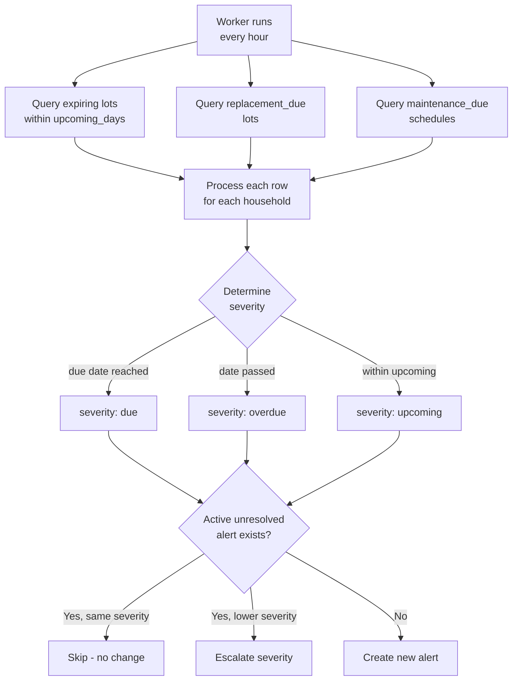
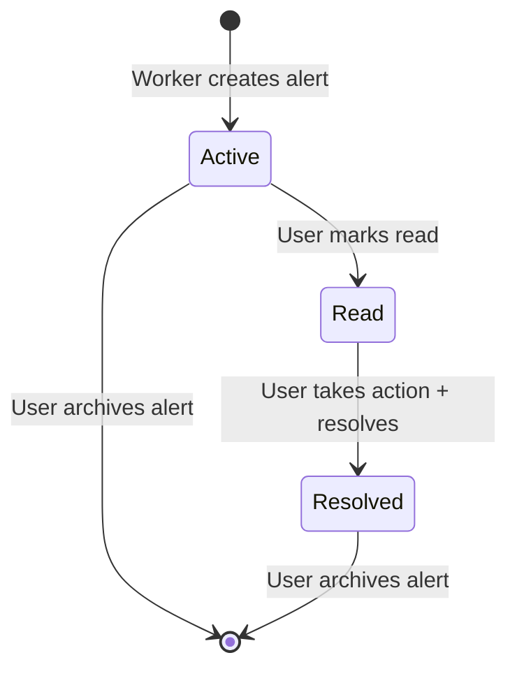

# 07 — Alerting and Prioritization


---

## Table of Contents

1. [Alert System Overview](#1-alert-system-overview)
2. [Alert Severity Model](#2-alert-severity-model)
3. [Alert Categories](#3-alert-categories)
4. [Alert Generation Pipeline](#4-alert-generation-pipeline)
5. [Current Prioritization Behavior](#5-current-prioritization-behavior)
6. [Alert Lifecycle (Statuses)](#6-alert-lifecycle-statuses)
7. [Duplicate Prevention](#7-duplicate-prevention)
8. [Triage Process](#8-triage-process)
9. [Alert Settings](#9-alert-settings)

---

## 1. Alert System Overview

The alert system is the **operational heartbeat** of bePrepared. It continuously monitors:
- Inventory lot expiry dates
- Inventory lot replacement cycles
- Maintenance schedule due dates

Alerts are generated by the background **worker** process (running on an hourly schedule) and surfaced on the dashboard and dedicated Alerts page.

[↑ Go to TOC](#table-of-contents)

---

## 2. Alert Severity Model

```
[ alert_upcoming_days before due ]───►[ DUE DATE ]──►[ OVERDUE ]
         UPCOMING                           DUE            past due date
```

| Time Stage | Trigger | Default Severity | UI Colour | Dashboard Priority |
|------------|---------|------------------|-----------|-------------------|
| `upcoming` | Within `alert_upcoming_days` days of due | `upcoming` | Neutral | Plan ahead |
| `due` | On due date | `due` | Amber | Act now |
| `overdue` | Past due date | `overdue` | Red | Resolve immediately |

Persisted alert severity values are `upcoming`, `due`, and `overdue`.

**Default window:**
- Upcoming: 14 days ahead

`alert_upcoming_days` is configurable in Settings.

[↑ Go to TOC](#table-of-contents)

---

## 3. Alert Categories

| Category | Source | Example |
|----------|--------|---------|
| `expiry` | `inventory_lots.expires_at` | "Water purification tablets expiring in 8 days" |
| `replacement` | `inventory_lots.next_replace_at` | "Stored water replacement due in 12 days" |
| `maintenance` | `maintenance_schedules.next_due_at` | "Generator test run overdue by 5 days" |

Additional enum values (`low_stock`, `task_due`, `policy`) exist in schema for future expansion but are not currently generated by the worker.

[↑ Go to TOC](#table-of-contents)

---

## 4. Alert Generation Pipeline



[↑ Go to TOC](#table-of-contents)

---

## 5. Current Prioritization Behavior

Current implementation keeps prioritization simple and explicit:

- API returns household alerts ordered by `dueAt` ascending.
- UI highlights by severity (`overdue` > `due` > `upcoming`).
- Dashboard shows unresolved alert counts and recent active alerts.

There is no weighted multi-factor scoring model currently implemented.

[↑ Go to TOC](#table-of-contents)

---

## 6. Alert Lifecycle (Statuses)



**Alert fields:**

| Field | Description |
|-------|-------------|
| `is_read` | Boolean read flag (`false` by default) |
| `is_resolved` | Boolean resolved flag (`false` by default) |
| `resolved_at` | UTC timestamp of resolution |
| `archived_at` | Soft-archived (dismissed or auto-cleaned) |

[↑ Go to TOC](#table-of-contents)

---

## 7. Duplicate Prevention

The worker uses an **entity-based idempotent upsert** approach:

```
For each candidate alert (household + entity_type + entity_id):
  IF unresolved active alert exists for that entity:
    IF new severity is higher → UPDATE severity
    ELSE                      → SKIP (no duplicate)
  ELSE:
    INSERT new alert
```

This prevents the alert queue from flooding with duplicate entries on each hourly run.

[↑ Go to TOC](#table-of-contents)

---

## 8. Triage Process

When reviewing alerts, apply this triage order:

```
Step 1: Sort by OVERDUE first, then DUE, then UPCOMING

Step 2: Within OVERDUE, sort by life-safety weight:
  → Medical overdue first
  → Water overdue second
  → Power/Comms overdue third
  → Others

Step 3: For each alert, take the minimum required action:
  → Expiry:      Consume or dispose + purchase replacement
  → Replacement: Purchase replacement + update lot
  → Maintenance: Perform task + record event
  
Step 4: Resolve the alert in the system (click "Resolve")

Step 5: Re-check dashboard — confirm unresolved counts trend down
```

[↑ Go to TOC](#table-of-contents)

---

## 9. Alert Settings

| Setting | Location | Default |
|---------|----------|---------|
| Upcoming lead time | Settings → Planning Targets → `alert_upcoming_days` | 14 days |
| Worker run interval | Environment variable `WORKER_INTERVAL_MS` | 3600000 (1 hour) |

**Recommended production settings:**
- `alert_upcoming_days`: 14-30 days based on household cadence
- Worker interval: 3600000 (1 hour) is sufficient for daily alerting

[↑ Go to TOC](#table-of-contents)

---

*Content licensed under [CC BY-NC-SA 4.0](https://creativecommons.org/licenses/by-nc-sa/4.0/) · bePrepared Disaster Preparedness System*
