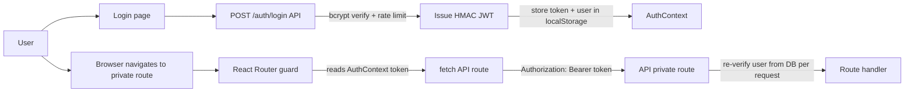

# 15 — Deep Dive: Authentication and Session Architecture

---

## Table of Contents

1. [Scope](#1-scope)
2. [End-to-End Auth Flow](#2-end-to-end-auth-flow)
3. [Current Implementation (Code Map)](#3-current-implementation-code-map)
4. [Trust Boundaries](#4-trust-boundaries)
5. [Security Strengths](#5-security-strengths)
6. [Remaining Risks and Constraints](#6-remaining-risks-and-constraints)
7. [Recommended Next Hardening Moves (Optional)](#7-recommended-next-hardening-moves-optional)
8. [Verification Checklist](#8-verification-checklist)

> Deep dive #1 from the remediation backlog. This document describes the implemented auth/session model, trust boundaries, and hardening posture for the **current** architecture: a Vite SPA with custom `AuthContext`, `localStorage`-persisted JWT tokens, and direct API calls (no BFF proxy, no NextAuth).

---

## 1. Scope

[↑ TOC](#table-of-contents)

This deep dive covers:

- API login and token issuance
- API request authentication and authorization flow
- Frontend session handling (`AuthContext` + `localStorage` JWT strategy)
- Route protection in React Router
- Key residual risks and operational guidance

---

## 2. End-to-End Auth Flow

[↑ TOC](#table-of-contents)

**Key characteristics:**

- The frontend is a pure client-side SPA (Vite + React Router v6)
- There is no server-side session, no BFF proxy, and no SSR
- The JWT is stored in `localStorage` under the key `bp_token`
- The authenticated user object is stored in `localStorage` under the key `bp_user`
- All private API calls inject the token via `Authorization: Bearer <token>`

---

## 3. Current Implementation (Code Map)

[↑ TOC](#table-of-contents)

- **Token format + crypto**: `api/src/lib/authToken.ts`
  - HMAC SHA-256 signed token (`HS256` style JWT shape)
  - `timingSafeEqual` signature comparison
  - Claims include `sub`, `username`, `householdId`, `isAdmin`, `iat`, `exp`
- **Login endpoint**: `api/src/routes/auth/index.ts`
  - Credentials checked with `bcryptjs`
  - In-memory login rate limiting by `IP + normalized username`
  - API token TTL: 12 hours
- **API global auth gate**: `api/src/index.ts`
  - Public path allowlist: `/`, `/health`, `/auth/login` (+ `/docs*` non-production)
  - For private routes, token required and then user reloaded from DB (`archived_at IS NULL`)
  - Effective claims are request-scoped from DB values to eliminate stale privilege window
- **Route-level guards**: `api/src/lib/routeAuth.ts`
  - `requireAuth`, `requireHouseholdScope`, `requireAdmin`
  - Uses request-scoped claims cache first
- **Frontend auth context**: `frontend/src/contexts/AuthContext.tsx`
  - Custom React context (`AuthContext`) providing `user`, `token`, `login()`, `logout()`
  - `login()` calls `POST /auth/login`, stores returned token and user in `localStorage`
  - `logout()` clears `localStorage` entries and resets context state
  - On mount, hydrates state from `localStorage` (persistent across tab reloads)
- **API client utility**: `frontend/src/lib/api.ts`
  - Reads `VITE_API_URL` env var (default `http://localhost:9996`) as the API base URL
  - Attaches `Authorization: Bearer <token>` header on all authenticated requests
  - All app calls go directly to the API — no proxy intermediary
- **Page protection**: React Router route guards in `frontend/src/router.tsx`
  - Non-public routes check `AuthContext.user`; redirect to `/login` if unauthenticated

---

## 4. Trust Boundaries

[↑ TOC](#table-of-contents)

1. **Browser boundary**
   - Browser stores the JWT in `localStorage` — accessible to JavaScript in the same origin
   - Token is sent directly to the API as a Bearer header (no server-side cookie or session)
2. **API boundary**
   - Token signature/expiry verified on every private request
   - User is revalidated against DB on every private request (no stale privilege window)
3. **DB boundary**
   - `users.archived_at` and `users.is_admin` are the current source of truth
   - Admin demotion takes effect on the next API request

**Notable difference from BFF architecture:** Because there is no BFF server-side proxy, the raw JWT is held in the browser's `localStorage` and sent directly to the API. This is standard for SPA auth patterns but means the token is accessible to any JavaScript running on the same origin.

---

## 5. Security Strengths

[↑ TOC](#table-of-contents)

- Login endpoint has request throttling (in-memory, IP + username)
- API rejects `AUTH_ENABLED=false` in production on startup
- API enforces explicit production CORS constraints (`CORS_ORIGINS` env var, no wildcard)
- Admin privilege revocation is near-immediate due to per-request DB revalidation
- Swagger is not public in production and interactive mode is disabled
- Token TTL is 12 hours, limiting the window of a stolen token

---

## 6. Remaining Risks and Constraints

[↑ TOC](#table-of-contents)

- **`localStorage` XSS exposure**: if an XSS vulnerability exists in the frontend, the JWT can be exfiltrated. Mitigation: strict CSP headers, avoiding `dangerouslySetInnerHTML` and `eval`-based patterns, keeping dependencies updated.
- Login rate limiter is in-memory; horizontal scaling requires shared limiter storage (Redis or DB-backed counter)
- API token revocation is still coarse-grained (exp-based) rather than denylist/session-version based
- No automatic token refresh; users must re-login after 12h token expiry
- `localStorage` is not isolated per tab for the same origin (shared state across tabs is acceptable for this use case)

---

## 7. Recommended Next Hardening Moves (Optional)

[↑ TOC](#table-of-contents)

1. Add a short-lived `httpOnly` cookie option as an alternative to `localStorage` to eliminate XSS token exfiltration risk.
2. Add distributed rate limiting (Redis or DB-backed counter) for `/auth/login`.
3. Add token/session versioning in `users` to support explicit server-side invalidation.
4. Add auth observability counters (failed logins, 401/403 rates).
5. Add targeted auth integration tests for expired-token and demoted-admin live behavior.

---

## 8. Verification Checklist

[↑ TOC](#table-of-contents)

- [x] Successful `POST /auth/login` returns JWT; stored in `localStorage` under `bp_token`
- [x] All private API calls include `Authorization: Bearer <token>` header
- [x] API private routes reject unauthenticated calls (`401`)
- [x] Household scope mismatch yields `403` for non-admin users
- [x] Admin demotion takes effect on next request due to DB-backed claims refresh
- [x] `logout()` clears both `bp_token` and `bp_user` from `localStorage`
- [x] Browser redirect to `/login` occurs when `AuthContext.user` is null on a protected route

---

_Content licensed under CC BY-NC-SA 4.0._
