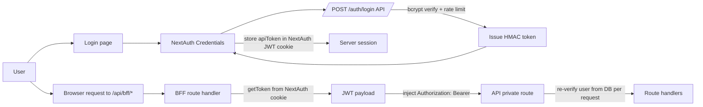

# 15 — Deep Dive: Authentication and Session Architecture

> Deep dive #1 from the remediation backlog. This document describes the implemented auth/session model, trust boundaries, and hardening posture.

---

## 1. Scope

This deep dive covers:

- API login and token issuance
- API request authentication and authorization flow
- Frontend session handling (NextAuth JWT strategy)
- BFF proxy behavior and token containment
- Route protection in Next.js middleware
- Key residual risks and operational guidance

---

## 2. End-to-End Auth Flow

---

## 3. Current Implementation (Code Map)

- **Token format + crypto**: `api/src/lib/authToken.ts`
  - HMAC SHA-256 signed token (`HS256` style JWT shape)
  - `timingSafeEqual` signature comparison
  - Claims include `sub`, `username`, `householdId`, `isAdmin`, `iat`, `exp`
- **Login endpoint**: `api/src/routes/auth/index.ts`
  - Credentials checked with `bcryptjs`
  - In-memory login rate limiting by `IP + normalized username`
  - API token TTL: 12 hours
- **API global auth gate**: `api/src/index.ts`
  - Public path allowlist: `/`, `/health`, `/auth/login` (+ `/docs*` non-production)
  - For private routes, token required and then user reloaded from DB (`archived_at IS NULL`)
  - Effective claims are request-scoped from DB values to eliminate stale privilege window
- **Route-level guards**: `api/src/lib/routeAuth.ts`
  - `requireAuth`, `requireHouseholdScope`, `requireAdmin`
  - Uses request-scoped claims cache first
- **Frontend auth config**: `frontend/src/auth.ts`
  - NextAuth v5 Credentials provider calls API `/auth/login`
  - API token is stored in NextAuth JWT callback, not returned in session callback
- **BFF proxy**: `frontend/src/app/api/bff/[...path]/route.ts`
  - Reads NextAuth JWT via `getToken`
  - Injects API bearer token server-side
  - Browser never receives raw API token in session payload
- **Client/server API utility**: `frontend/src/lib/api.ts`
  - All app calls go through `/api/bff/*`
  - Server-side requests forward cookies to preserve session context
- **Page protection**: `frontend/src/middleware.ts`
  - Non-public routes require authenticated session user

---

## 4. Trust Boundaries

1. **Browser boundary**
   - Browser has NextAuth session cookie
   - Browser does not receive raw API token in session JSON
2. **BFF boundary**
   - Token extraction and bearer injection happen server-side only
   - Authorization header from browser is dropped and replaced
3. **API boundary**
   - Token signature/expiry verified
   - User is revalidated against DB on every private request
4. **DB boundary**
   - `users.archived_at` and `users.is_admin` are current source of truth

---

## 5. Security Strengths

- API token is not exposed to client session payloads
- Login endpoint has request throttling
- API rejects `AUTH_ENABLED=false` in production
- API enforces explicit production CORS constraints
- Admin privilege revocation is near-immediate due to DB revalidation
- Swagger is not public in production and interactive mode is disabled

---

## 6. Remaining Risks and Constraints

- Login rate limiter is in-memory; horizontal scaling requires shared limiter storage
- API token revocation is still coarse-grained (exp-based) rather than denylist/session-version based
- NextAuth cookie/session lifetime (30 days) is longer than API token lifetime (12h); system relies on re-login behavior when token expires
- BFF proxy forwards broad request headers; acceptable now, but header allowlist tightening could reduce accidental coupling

---

## 7. Recommended Next Hardening Moves (Optional)

1. Add distributed rate limiting (Redis or DB-backed counter) for `/auth/login`.
2. Add token/session versioning in `users` to support explicit server-side invalidation.
3. Add auth observability counters (failed logins, 401/403 rates, dependency on BFF 401s).
4. Add targeted auth integration tests for expired-token and demoted-admin live behavior.

---

## 8. Verification Checklist

- [x] Browser session object does not include `apiToken`
- [x] BFF requires valid NextAuth JWT and returns `401` if missing
- [x] API private routes reject unauthenticated calls (`401`)
- [x] Household scope mismatch yields `403` for non-admin users
- [x] Admin demotion takes effect on next request due to DB-backed claims refresh

---

_Content licensed under CC BY-NC-SA 4.0._
