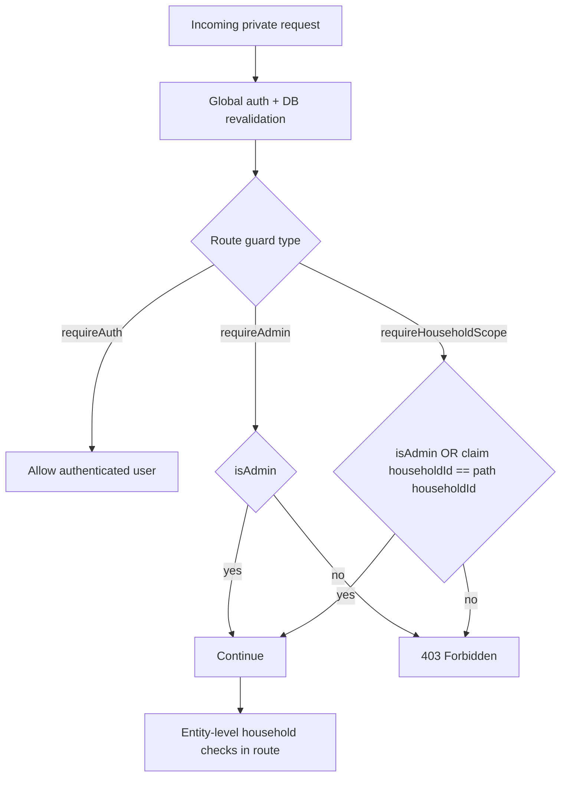

# 16 — Deep Dive: API Authorization and Household Scoping

> Deep dive #2 from the remediation backlog. This document maps how authorization is enforced across API routes, where household boundaries are applied, and where residual edge cases remain.

---

## 1. Scope

This deep dive covers:

- API auth gate and request claim derivation
- Route-level authorization guards
- Household-scoped endpoint behavior
- Admin-only endpoint behavior
- Consistency gaps and practical hardening follow-ups

---

## 2. Authorization Layers

Authorization is implemented as a layered model:

1. **Global private-route gate** (`api/src/index.ts`)
   - Rejects private requests without valid bearer token (`401`)
   - Revalidates user against DB (`users.archived_at IS NULL`)
   - Rebuilds request-scoped claims from DB (`isAdmin`, `householdId`)
2. **Route guard functions** (`api/src/lib/routeAuth.ts`)
   - `requireAuth` → any authenticated user
   - `requireHouseholdScope` → admin OR `claims.householdId === route householdId`
   - `requireAdmin` → admin only
3. **Entity-level validation in route handlers**
   - Confirms category/item/profile/schedule IDs belong to requested household context
   - Prevents cross-household references even with valid path household

---

## 3. Household Scope Model

Household scoping is path-driven for most domain routes (`/:householdId/...`).

Admins can operate across households by path value; non-admins are restricted to their own household.

---

## 4. Route Guard Coverage (Current)

Based on route inspection:

- **`households`**: mixed (`requireAuth`, `requireAdmin`, `requireHouseholdScope`)
- **`modules`**: read auth (`requireAuth`), write admin (`requireAdmin`)
- **`tasks`**:
  - library writes admin (`POST/PATCH /tasks*`)
  - household progress scoped (`/:householdId/progress*`)
  - dependency read auth and dependency write admin
- **`inventory`**, **`equipment`**, **`maintenance`**, **`alerts`**, **`settings`**, **`planning`**:
  - predominantly `requireHouseholdScope`
  - additional in-handler category/record household validation

---

## 5. Strengths

- **Stale privilege reduction**: admin demotion and archived-user lockout are effective on next request because claims are DB-refreshed globally.
- **Consistent household gate primitive**: `requireHouseholdScope` is used broadly and uniformly.
- **Category ownership hardening**: shared helper functions now centralize allowed/custom category checks for inventory/equipment.
- **Dependency-aware task completion**: task completion authorization is combined with domain preconditions (dependency completion).

---

## 6. Known Gaps / Tradeoffs

- **Household list visibility for admins**: by design admins can enumerate all active households (`GET /households`). This is operationally useful but broad.
- **Auth semantics encoded in handlers**: many endpoints return `{ error: "Forbidden" }` manually after guard checks; behavior is consistent but repetitive.
- **No explicit policy layer abstraction**: authorization logic is robust but still route-centric rather than a separate policy engine.

---

## 7. Recommended Next Hardening (Optional)

1. Add a small authorization helper wrapper to standardize guard failure payloads (`401/403` body shape).
2. Add API integration tests for cross-household access attempts on each major domain route group.
3. Add authorization audit telemetry for denied requests by route and guard type.
4. Consider optional admin scope partitions (future multi-tenant mode) if needed beyond single-deployment household admin model.

---

## 8. Verification Checklist

- [x] Private requests without bearer token receive `401`.
- [x] Non-admin user cannot access other households by path (`403`).
- [x] Admin can access cross-household routes by explicit path.
- [x] Entity-level checks reject invalid category ownership for household-bound writes.
- [x] Archived users are rejected even if token signature is valid.

---

_Content licensed under CC BY-NC-SA 4.0._
