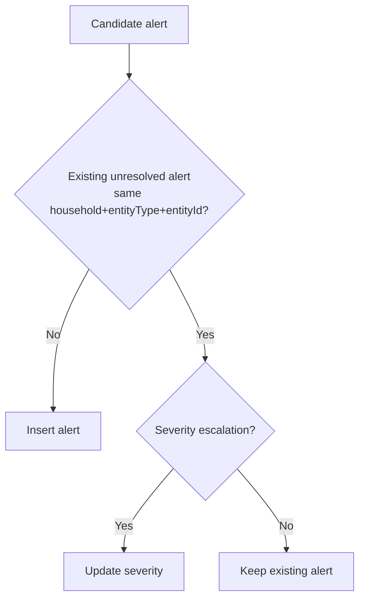

# 17 — Deep Dive: Alert Generation and Escalation Correctness

---

## Table of Contents

1. [Scope](#1-scope)
2. [Worker Pipeline (Implemented)](#2-worker-pipeline-implemented)
3. [Severity Assignment Model](#3-severity-assignment-model)
4. [Escalation and Idempotency](#4-escalation-and-idempotency)
5. [API Alert Lifecycle](#5-api-alert-lifecycle)
6. [Correctness Strengths](#6-correctness-strengths)
7. [Known Constraints / Gaps](#7-known-constraints--gaps)
8. [Optional Hardening Follow-ups](#8-optional-hardening-follow-ups)
9. [Verification Checklist](#9-verification-checklist)

> Deep dive #3 from the remediation backlog. This document validates how alerts are generated, deduplicated, escalated, and surfaced.

---

## 1. Scope

[↑ TOC](#table-of-contents)

This deep dive reviews:

- Worker alert generation logic
- Severity assignment and escalation behavior
- Deduplication/idempotency rules
- API alert lifecycle operations
- Correctness gaps and practical hardening options

---

## 2. Worker Pipeline (Implemented)

[↑ TOC](#table-of-contents)

The worker runs immediately on startup and then every `WORKER_INTERVAL_MS` (default: 1 hour).

Current jobs:

1. Inventory expiry (`category=expiry`)
2. Inventory replacement due (`category=replacement`)
3. Maintenance schedule due (`category=maintenance`)

Source: `worker/src/index.ts`

---

## 3. Severity Assignment Model

[↑ TOC](#table-of-contents)

For each due date candidate, severity is computed as:

- `overdue`: date < today
- `due`: date == today
- `upcoming`: date > today and within `alert_upcoming_days`

`alert_upcoming_days` is resolved per household from:

1. household policy override (`household_policies.alert_upcoming_days`)
2. fallback default (`policy_defaults.alert_upcoming_days`)
3. fallback constant `14`

---

## 4. Escalation and Idempotency

[↑ TOC](#table-of-contents)

Behavior details:

- Alert uniqueness is effectively per unresolved entity (`householdId + entityType + entityId`).
- Existing unresolved alerts are not duplicated on repeated worker runs.
- Severity only moves upward (`upcoming -> due -> overdue`).
- No automatic severity downgrade is applied.

---

## 5. API Alert Lifecycle

[↑ TOC](#table-of-contents)

Alert state operations are handled in `api/src/routes/alerts/index.ts`:

- `GET /alerts/:householdId` (+ optional status/unread/unresolved filters)
- `PATCH /alerts/:householdId/:alertId/read` -> sets `isRead=true`
- `PATCH /alerts/:householdId/:alertId/resolve` -> sets `isResolved=true`, `resolvedAt=now`
- `DELETE /alerts/:householdId/:alertId` -> soft archive (`archivedAt=now`)

Household scoping is enforced with `requireHouseholdScope` on all alert routes.

---

## 6. Correctness Strengths

[↑ TOC](#table-of-contents)

- Worker jobs are deterministic and bounded to explicit due-date domains.
- Household-specific upcoming window is respected.
- Idempotent unresolved-entity upsert avoids duplicate queue growth.
- Escalation behavior is monotonic (no accidental downgrade).
- API lifecycle is simple and auditable (`read`, `resolved`, `archived`).

---

## 7. Known Constraints / Gaps

[↑ TOC](#table-of-contents)

- No auto-resolution when source condition disappears (resolution is operator-driven).
- Dedup key does not include category in lookup; same entity across categories could collide if modeled that way in future.
- No explicit worker metrics/log counters for generated/escalated/skipped alerts.
- Additional schema categories (`low_stock`, `task_due`, `policy`) are not yet produced by worker jobs.

---

## 8. Optional Hardening Follow-ups

[↑ TOC](#table-of-contents)

1. Add category to unresolved-lookup key if future jobs can emit multiple categories per entity.
2. Add automatic stale alert reconciliation (optional job to resolve invalidated conditions).
3. Add worker run metrics (inserted/escalated/skipped/errors by category).
4. Add integration tests for escalation transitions and idempotency over repeated runs.

---

## 9. Verification Checklist

[↑ TOC](#table-of-contents)

- [x] Worker produces only `expiry`, `replacement`, `maintenance` categories.
- [x] Severity computation aligns with due-date comparisons.
- [x] Repeated runs do not duplicate unresolved alerts for same entity.
- [x] Severity escalation updates existing unresolved alerts.
- [x] Alert API operations are household-scoped and soft-archive based.

---

_Content licensed under CC BY-NC-SA 4.0._
