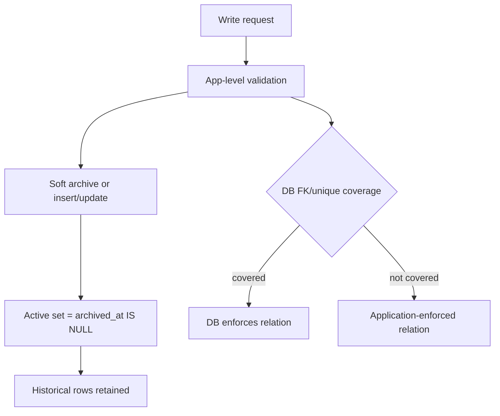

# 18 — Deep Dive: Data Model Constraints, Indexes, and FK Strategy

> Deep dive #4 from the remediation backlog. This document assesses schema-level integrity controls, index posture, and foreign key strategy in the current MariaDB model.

---

## 1. Scope

This deep dive evaluates:

- Existing unique and enum constraints
- Implemented foreign keys and delete actions
- Index coverage for common query paths
- Archive-first lifecycle implications on integrity/performance

---

## 2. Constraint Posture (Current)

### 2.1 Strong constraints already present

- Primary keys across all core tables (`varchar(36)` IDs or natural key for `policy_defaults.key`)
- Key uniqueness constraints:
  - `users.username` unique
  - `modules.slug` unique
  - `household_people_profiles (household_id, name)` unique
  - `sections (module_id, slug)` unique
  - `maintenance_templates (category_slug, name)` unique
  - `battery_profiles.name` unique
  - Category slug uniqueness per household:
    - `inventory_categories (household_id, slug)`
    - `equipment_categories (household_id, slug)`
- Enum constraints on important state columns (task status/class/level/scenario, alert severity/category, equipment status, etc.)

### 2.2 Soft-delete/archival model

Most mutable tables include `archived_at`. The application treats non-archived rows as active and avoids hard deletes.

---

## 3. Foreign Key Strategy (Current)

Implemented FKs (migration `0003_hybrid_categories_fk.sql`):

- `inventory_categories.household_id -> households.id` (`ON DELETE SET NULL`)
- `equipment_categories.household_id -> households.id` (`ON DELETE SET NULL`)
- `inventory_items.category_id -> inventory_categories.id` (`ON DELETE SET NULL`)
- `inventory_lots.item_id -> inventory_items.id` (`ON DELETE RESTRICT`)
- `equipment_items.category_id -> equipment_categories.id` (`ON DELETE SET NULL`)

Observations:

- FK usage is selective, centered on category/item integrity.
- Many relationships remain application-enforced rather than DB-enforced (e.g., tasks->modules/sections, task_progress->tasks/households, maintenance schedules/events chains).
- This is workable for archive-first patterns, but leaves room for orphan risk if application logic regresses.

---

## 4. Index Posture (Current)

Known explicit indexes from migrations:

- `inventory_categories_household_idx`
- `equipment_categories_household_idx`
- unique indexes listed in section 2
- generated unique key for active task progress (`task_progress.active_task_key`) from `0004_task_progress_active_unique.sql`

High-value query patterns in code frequently filter by:

- `household_id`
- `archived_at IS NULL`
- date windows (`expires_at`, `next_replace_at`, `next_due_at`, `due_at`)
- pair predicates (e.g., `household_id + task_id`, `household_id + category_id`)

Potential performance gap:

- No broad set of composite indexes for `household_id + archived_at + date/status` query paths.
- Current scale may tolerate this, but large household datasets or long retention windows can degrade scans.

---

## 5. Integrity and Archive-Only Tradeoffs

The model intentionally prioritizes historical retention and reversible operations. That makes app-level validation a first-class integrity mechanism. The cost is that integrity guarantees are split between DB and application code.

---

## 6. Recommended Next Improvements

1. Add targeted composite indexes for highest-frequency filtered reads, for example:
   - `alerts (household_id, archived_at, is_resolved, due_at)`
   - `inventory_lots (household_id, archived_at, expires_at)`
   - `inventory_lots (household_id, archived_at, next_replace_at)`
   - `maintenance_schedules (equipment_item_id, archived_at, is_active, next_due_at)`
2. Add FKs for currently app-enforced relationships where archive semantics permit (or document intentional non-FK choices per table).
3. Add DB-level check constraints where practical (or generated-column guards) for invariant-like fields.
4. Add periodic orphan detection queries as CI/ops health checks if some relationships remain app-only.

---

## 7. Verification Checklist

- [x] Core uniqueness constraints identified and mapped.
- [x] Implemented FK set and delete actions documented.
- [x] Active-task uniqueness mechanism (`active_task_key`) verified.
- [x] Index/query-pattern gaps identified for scale-up planning.

---

_Content licensed under CC BY-NC-SA 4.0._
