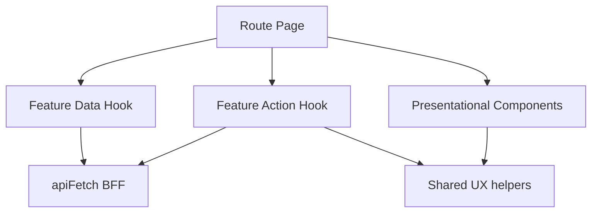

# 19 — Deep Dive: Frontend Maintainability Refactor Plan

> Deep dive #5 from the remediation backlog. This document captures the maintainability posture of the Next.js frontend and a pragmatic incremental refactor roadmap.

---

## 1. Current State Summary

The frontend has already completed a major decomposition wave:

- `tasks`, `inventory`, and `equipment` pages split into focused modules
- shared form and row components extracted
- data and action hooks introduced (`use*Data`, `use*Actions`)
- category settings UI unified in a shared `CategoryManager`

This reduced page-size complexity and duplicated JSX substantially.

---

## 2. Remaining Maintainability Pressure Points

Even after decomposition, these areas still carry complexity risk:

1. **Action orchestration spread**
   - Some operations still rely on page-level state fan-out and cross-hook coupling.
2. **Error/message UX consistency**
   - Localized `error` / `message` handling patterns differ between feature pages.
3. **Hook contract consistency**
   - Hook return shapes are similar but not standardized into shared conventions.
4. **Cross-feature shared primitives**
   - Repeated patterns (confirm+archive+reload, optimistic update fallback) could be centralized.

---

## 3. Target Architecture (Frontend)

Design goals:

- Pages become composition shells
- Hooks own business/data mutation logic
- Components stay mostly presentational
- Shared UX/state helpers reduce repeated edge-case code

---

## 4. Refactor Phases

### Phase A — Standardize hook contracts

- Normalize hook return shape (`loading`, `error`, `message`, `reload`, action methods).
- Add light typing conventions for action result payloads.

### Phase B — Shared UI behavior utilities

- Extract repeatable flows:
  - archive confirmation wrappers
  - mutation status helper (`idle/saving/success/error`)
  - standard error normalization

### Phase C — Page simplification pass

- Reduce each route page to:
  - household/session guard
  - hook wiring
  - rendering sections

### Phase D — Broaden frontend test coverage

- Add focused tests around shared hooks/utilities.
- Add smoke tests for key settings/inventory/equipment interaction surfaces.

---

## 5. Guardrails

- Preserve current visual language and UX behavior.
- Avoid large-bang rewrites; keep changes small and verifiable.
- Prefer additive helper extraction over broad abstraction layers.

---

## 6. Success Criteria

- Feature pages are orchestration-only (minimal mutation logic inline).
- Repeated action/error patterns are shared utilities.
- New contributors can trace data flow route -> hook -> API quickly.
- Frontend test suite captures core happy-path and failure-path flows.

---

## 7. Verification Checklist

- [x] Current maintainability strengths and remaining hotspots identified.
- [x] Target route -> hook -> component architecture documented.
- [x] Incremental phased refactor plan defined.
- [x] Clear success criteria established for follow-up implementation.

---

_Content licensed under CC BY-NC-SA 4.0._
