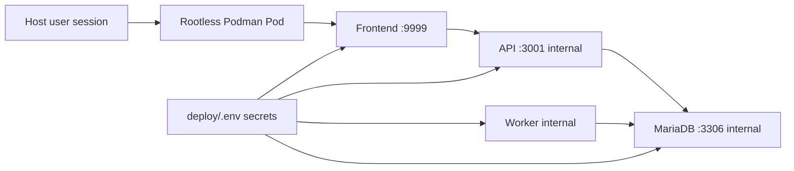

# 20 — Deep Dive: Deployment Hardening (Podman/Quadlet)

---

## Table of Contents

1. [Scope](#1-scope)
2. [Current Deployment Posture (Implemented)](#2-current-deployment-posture-implemented)
3. [Trust Boundary Snapshot](#3-trust-boundary-snapshot)
4. [Hardening Gaps and Risk Notes](#4-hardening-gaps-and-risk-notes)
5. [Incremental Hardening Plan](#5-incremental-hardening-plan)
6. [Prioritized Next Actions](#6-prioritized-next-actions)
7. [Verification Checklist](#7-verification-checklist)

> Deep dive #6 from the remediation backlog. This document reviews current rootless Podman + Quadlet operations and defines an incremental hardening plan.

---

## 1. Scope

[↑ TOC](#table-of-contents)

This deep dive evaluates:

- Current deployment topology and trust boundaries
- Runtime service hardening in Quadlet units
- Secret and environment handling posture
- Operational resilience (startup ordering, health checks, backup/restore confidence)
- Practical follow-up steps, ordered by risk reduction

---

## 2. Current Deployment Posture (Implemented)

[↑ TOC](#table-of-contents)

The project runs as a rootless Podman pod managed by user systemd (Quadlet):

- Pod: `deploy/quadlet/beprepared.pod`
- Services:
  - `deploy/quadlet/beprepared-db.container`
  - `deploy/quadlet/beprepared-api.container`
  - `deploy/quadlet/beprepared-worker.container`
  - `deploy/quadlet/beprepared-frontend.container`
- Setup automation: `scripts/install.sh`

Operational strengths already in place:

- Rootless runtime model (reduced host blast radius)
- Clear service separation (db/api/worker/frontend)
- Persistent DB volume mount
- Restart-on-failure policies configured
- Documented backup/restore path in `docs/11-operations-podman.md`

---

## 3. Trust Boundary Snapshot

[↑ TOC](#table-of-contents)

Primary external exposure is the frontend host port (`9999`). API and DB remain internal to the pod network.

---

## 4. Hardening Gaps and Risk Notes

[↑ TOC](#table-of-contents)

1. **Container runtime restrictions are minimal**
   - Quadlet units do not yet define tighter controls such as read-only root FS, capability drops, or explicit writable paths.
2. **Environment file is shared across all services**
   - `deploy/.env` is convenient but broad; each service receives more variables than strictly required.
3. **Startup readiness is partially script-based**
   - `install.sh` waits for DB readiness, but steady-state health monitoring is still mostly log-driven.
4. **No formal restore drill cadence**
   - Backup/restore steps are documented, but no recurring validation routine is defined.

---

## 5. Incremental Hardening Plan

[↑ TOC](#table-of-contents)

### Phase A — Service-level confinement

- Add conservative Quadlet container constraints per service where compatible:
  - read-only root filesystem for frontend/worker where feasible
  - explicit writable temp/state paths
  - `NoNewPrivileges` style controls and capability minimization
- Validate startup and application behavior after each unit change.

### Phase B — Secret exposure minimization

- Split environment files by service role:
  - DB-only variables for DB container
  - API/worker-only runtime variables
  - frontend-only public/runtime variables
- Keep `deploy/.env` as source material if desired, but generate scoped env files for runtime mounts.

### Phase C — Health and recovery confidence

- Add lightweight health checks for API and frontend service process readiness.
- [x] Create an operator runbook section for "degraded mode" recovery (DB restart, API restart, worker catch-up).
- Establish a recurring restore test (for example monthly) with documented pass/fail criteria.

### Phase D — Change safety

- Add a deployment verification checklist after rebuild/restart:
  - service active status
  - basic endpoint checks
  - migration status
  - worker log sanity

---

## 6. Prioritized Next Actions

[↑ TOC](#table-of-contents)

1. [x] Implement minimal-risk Quadlet hardening flags for frontend and worker (`--read-only`, tmpfs `/tmp`, `no-new-privileges`, `--cap-drop=all`).
2. [ ] Introduce scoped env files to reduce secret sprawl (deferred by operator choice; shared `deploy/.env` retained for now).
3. [x] Add an operations check script for post-deploy health verification (`scripts/status.sh`).
4. [x] Document recurring backup-restore drill cadence and pass/fail criteria in operations runbook.
5. [x] Document degraded-mode recovery sequencing in operations troubleshooting runbook.

---

## 7. Verification Checklist

[↑ TOC](#table-of-contents)

- [x] Current Quadlet topology and service boundaries reviewed.
- [x] Existing operational strengths identified.
- [x] Key deployment hardening gaps documented.
- [x] Incremental risk-prioritized hardening plan defined.

---

_Content licensed under CC BY-NC-SA 4.0._
